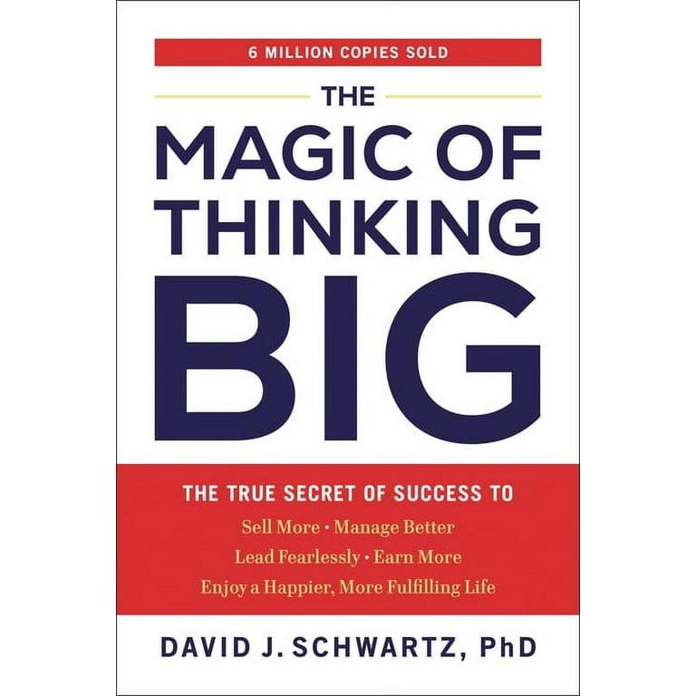
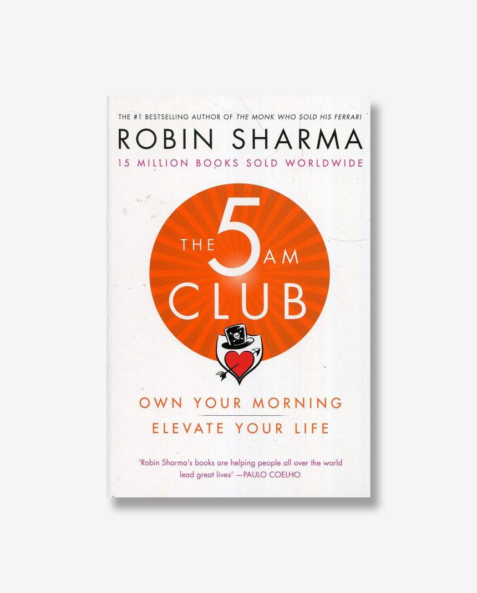
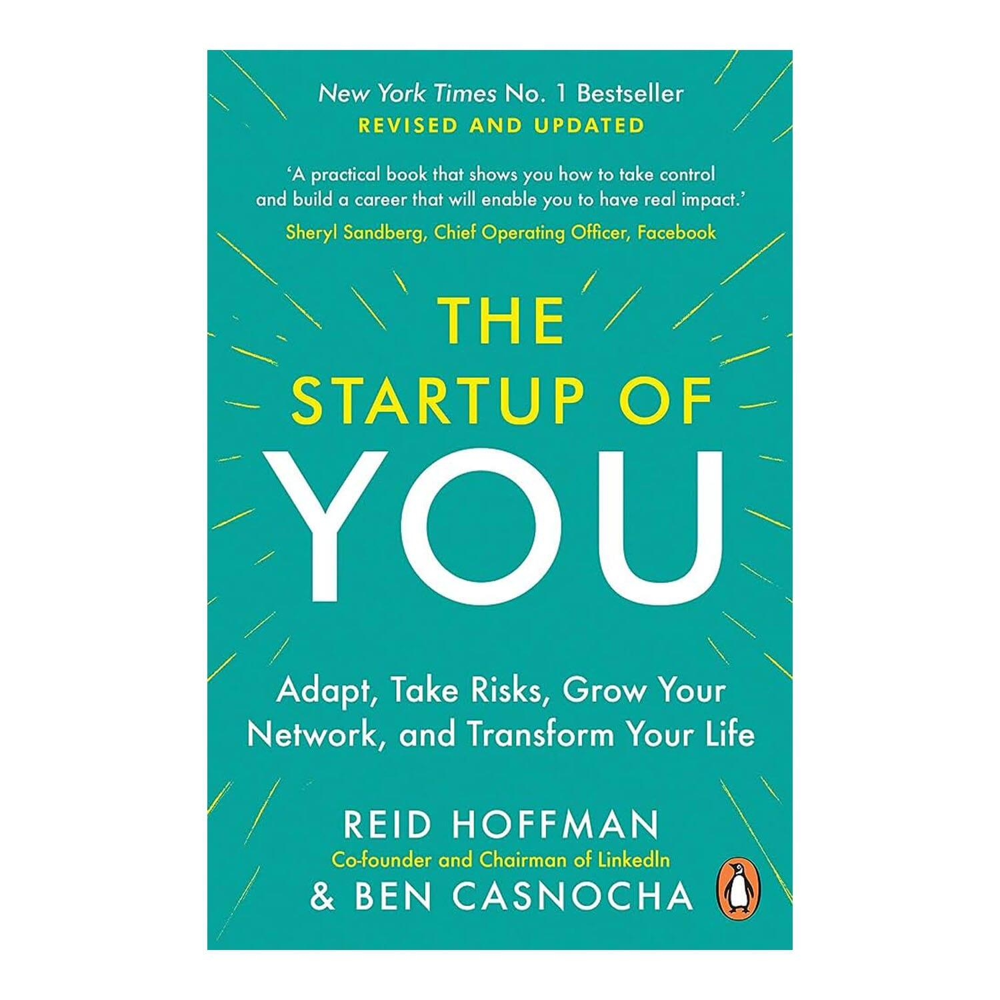
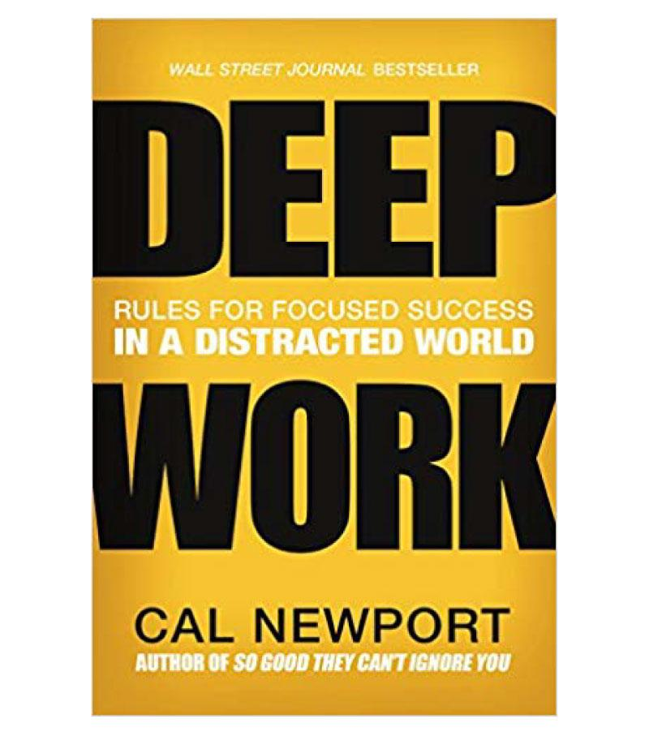
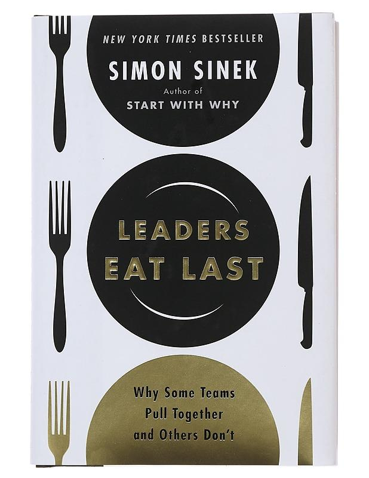
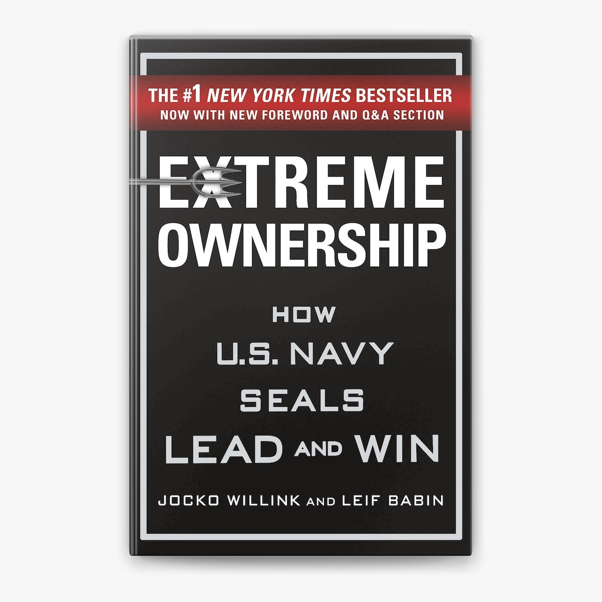

# Week 01 — Success Mindset (Mindset OS)

Part of the DevOps Micro Internship (DMI) Cohort 3 with Agentic AI

---

## Purpose (Read This First)

This week is not motivation homework.

This is you building your **Mindset OS** — the system you will use for the next 5 months (and honestly, for years).

### Expectations

* Be honest.
* Be specific.
* Be practical.
* Write like an adult professional: clear sentences, no one-liners.

You will reuse this in later weeks. So do it properly once.

---

# Assignment 1. What is something you believe to be true that most people around you would disagree with?

### Rules

* No "safe" answers.
* Must be your real belief (not copied from internet).
* Minimum 50 words.

**Hint:** What do you believe about career, money, learning, discipline, relationships, health, success, life, tech industry, etc. that most people don't agree with?

## Answer

I believe good health isn't guaranteed by lifestyle alone. While healthy habits are important, health is ultimately a gift from God. I've seen disciplined people become seriously ill, while others with unhealthy lifestyles remain healthy, showing there's no single formula for staying well.

---

# Assignment 2. What are the top 3 objective truths you discovered through experimentation and results?

### Definition

Objective truths do not depend on opinions. They hold true regardless of how people feel.

Write each truth in this format:

**Truth:** (1 sentence)

**Evidence from my life:** (2–4 lines: what you tried + what happened)

---

## Truth #1

### Truth

There's always a way if there is a will

### Evidence from my life

I've been stuck severally in life, not knowing how to proceed or where to turn to and as long as I don't stop trying and putting in effort, something will happen, there must eventually be a way to become unstuck eventually.

---

## Truth #2

### Truth

Success is delibrate not by chance or luck

### Evidence from my life

I have always seen positive result in my life when I don't leave things to chance or luck. We all pray to be lucky, but if luck brings in something, you have to be delibrate to keep it else you may lose it

---

## Truth #3

### Truth

You lose most of your childhood friends as you get older

### Evidence from my life

I have lost most of my childhood friends to death, marriage, relocation, betrayal, disagreement, success mindset and pride.

---

# Assignment 3. What does your 2.0 version look like?

### Instructions

Write as if a journalist is writing about you **3 to 7 years from now** (not 20 years).

**Minimum 300 words.**

### Rules

* Write in past tense, like it already happened.
* Don't use "likes to / wants to / hopes to."
* Use specifics:

  * built
  * shipped
  * led
  * published
  * earned
  * relocated
  * contributed
* Include skills proof:

  * projects
  * portfolios
  * GitHub
  * blogs
  * certifications
  * job role
  * leadership
  * community contribution
* Add 1–3 images if you can (optional but powerful).

### Publish It Publicly On Any ONE

* LinkedIn
* Medium
* WordPress
* Blogspot
* Personal blog
* Portfolio page

Include this line:

> **P.S. This post is part of the DevOps Micro Internship (DMI) with Agentic AI — Cohort 3 — by [Pravin Mishra](https://www.linkedin.com/in/pravin-mishra-aws-trainer/). My graded progress is public: https://dmi.pravinmishra.com/s/YOUR-GITHUB-USERNAME.html · Start your DevOps journey: https://dmi.pravinmishra.com/?utm_source=student&utm_medium=ps-blog&utm_campaign=cohort3**

## Your Article

**Diokpa Raphael D.: Building Cloud Solutions, Empowering Engineers, and Inspiring the Next Generation**

In today's rapidly evolving technology landscape, professionals who combine technical expertise with leadership and a passion for community are becoming increasingly valuable. Diokpa Raphael D. is one such professional. With more than five years of experience in DevOps and cloud engineering, he has built a reputation for helping organizations deliver applications efficiently by embracing DevOps culture, automation, and modern software delivery practices.

Throughout his career, Raphael has worked with engineering teams to design and implement robust CI/CD pipelines, automate infrastructure, and improve deployment processes across cloud environments. His approach extends beyond technology; he believes that successful DevOps is built on collaboration, continuous improvement, and shared ownership. These principles have enabled him to lead engineering teams and contribute to the successful delivery of numerous software projects.

A strong advocate for continuous learning, Raphael has earned professional certifications in both Microsoft Azure and Amazon Web Services (AWS), demonstrating his commitment to mastering industry best practices. His technical portfolio, available on GitHub at **https://github.com/czarhub**, showcases a growing collection of projects that reflect his practical experience and dedication to open-source learning.

Beyond his professional responsibilities, Raphael is passionate about developing others. Through initiatives such as the AWS Community Builders program and the Pravin Mishra DMI Program, he has contributed to nurturing a community of aspiring cloud and DevOps engineers by sharing knowledge, mentoring learners, and encouraging continuous professional growth.

Based in Lagos, Nigeria, Raphael balances his demanding career with a fulfilling family life alongside his wife and two children. He believes that professional success should complement, rather than replace, personal well-being. Family vacations and travel remain an important part of maintaining that balance.

Perhaps the philosophy that best defines Raphael's journey is his belief that opportunities are rarely given—they are created. He has consistently demonstrated that growth comes from preparation, resilience, and an unwavering commitment to learning. As cloud technologies continue to reshape the future of software engineering, Diokpa Raphael D. stands as an example of a professional who is not only adapting to change but helping others navigate it as well.

### Public Link
Paste your link here: https://medium.com/@diokpadaberechi/diokpa-raphael-d-54782ea2a4c1

`Add your URL here`

---

# Assignment 4. Have you ever cut corners (unethical / dishonest / shortcut behavior — not necessarily illegal)? If yes, how did it make you feel?

### Important

You don't need to write the full story.

Focus on the feeling:

* guilt
* fear
* shame
* stress
* regret
* numbness
* etc.

This is about self-awareness, not judgment.

### Answer Format

**Yes / No**

If Yes:

**What emotion did you feel?** (minimum 50–100 words)

## Answer

Yes, I have been dishonest before. I inflated the price of an item I purchased for my boss, added extra money for myself, and manipulated the receipt to hide it. The moment I submitted the receipt, I was overwhelmed by fear that I would be caught. That fear quickly turned into guilt, shame, and constant stress. Every conversation about finances made me anxious, and I lived with the regret of betraying someone's trust. Although no one confronted me at the time, the emotional burden stayed with me, leaving me numb and reminding me that dishonesty always comes at a much higher cost than the money gained.

# Assignment 5. What are 10 non-fiction books you plan to read in the next 1 year?

### Rules

* Mention **Title + Author**
* Any language allowed
* No fiction novels

### Tip

Choose books that improve:

* mindset
* communication
* productivity
* health
* money
* career
* leadership

## Book List

1. The Magic of thinking big - David J. Schwartz

2. The Phycology of Money - Morgan Housel

3. The 5AM Club - Robin Sharma

4. Getting things Done - David Allen

5. The Start up of You - Reid Hoffman

6. Deep Work - Carl Newport

7. Crucial Conversations - Kerry Patterson

8. Leaders Eat Last - Simon Sinek

9. Extreme Ownership - Jacko Wilinks

10. The Millionaire Fastlane - MJ DeMarco

---

# Assignment 6. What are the things you will measure regularly in your life and career?

### Rules

List topics only. No need to share numbers.

### Must Include

* Learning / skill
* Output / proof
* Health / energy
* Time / focus
* Money / finance (personal or business)

### Example

* Learning hours per week
* Deep work sessions per week
* Projects shipped / documented
* Steps / workouts
* Sleep hours
* Spending tracker

## My Metrics

* Learning hours per week
* Amount i'm able to save in a month
* Steps taken in a week
* Time spent with Family and loved ones
* Amount of Time Spent on Liesure and Relaxation
* Quality of Project Shipped and Documented

---

# Assignment 7. Brain Dump + 5-Month System Plan

## Step 1: Brain Dump (Private)

Do a brain dump of everything in your mind into a notebook.

Examples:

* Bills
* Tasks
* Worries
* Goals
* Pending messages
* Ideas
* Responsibilities

### Did You Do It?

**Yes / No**

Answer:

Yes

---

## Step 2: Your 5-Month Routine + Focus Blocks

Create a simple plan you can realistically follow for the next 5 months.

### Weekly Routine

Example:

* Mon–Thu: 60 min deep work
* Sat: DMI session
* Sun: Weekly review

#### My Weekly Routine

* Mon - Friday 1 hour personal 
* Monday - Friday 1:30mins of DMI Work
* Sat: Workout/DMI 
* Weekly Review and Plan for the new week

---

### Focus Blocks

#### When Will You Do DMI Work? (Days + Time)

Monday - Friday 1:30mins

#### How Many Sessions Per Week?

5 sessions per week

---

### Distraction Rules

Examples:

* Phone rules
* Social media rules
* Environment setup

#### My Distraction Rules

* Phone on DnD
* Early Morning/Late Night Session

---

# Reflection – Week 1

### Biggest insight I got about myself this week

I can't do everything but I can do anything I set my mind to do and I'll will be great at it

### My biggest weakness/loop I noticed

Procastination

### One system I will implement from this week (exact habit + time)

Take action immediately I get a thought or document it 

### LinkedIn Post

Paste your LinkedIn post link here: https://www.linkedin.com/posts/diokparaphael_successmindset-growthmindset-motivation-activity-7478849934444724224-AUM4?utm_source=share&utm_medium=member_desktop&rcm=ACoAABJFGsoB0Tj582Besj5R2uLnB6itVJv47yU

`Add your URL here`

---

## 10. Proof of Work

- LinkedIn Post URL: https://www.linkedin.com/posts/diokparaphael_successmindset-growthmindset-motivation-activity-7478849934444724224-AUM4?utm_source=share&utm_medium=member_desktop&rcm=

- Blog / Medium : https://medium.com/@diokpadaberechi/the-gods-are-not-to-blame-but-are-we-02541ef8609fgit add 

---

## 📌 About DMI & CloudAdvisory

DevOps Micro Internship (DMI) is a project-based DevOps program run by Pravin Mishra (The CloudAdvisory) focused on real-world execution, systems thinking, and career readiness.

It helps learners build strong DevOps foundations with hands-on experience.

## 📌 Resources

- 🌐 **DMI Official Website:** https://pravinmishra.com/dmi  
- 🎓 **DevOps for Beginners (Udemy):** https://www.udemy.com/course/devops-for-beginners-docker-k8s-cloud-cicd-4-projects/  
- 🎓 **Ultimate Agentic AI DevOps with Clude Code** https://www.udemy.com/course/ultimate-agentic-ai-devops-with-claude-code/?referralCode=448389767BC96284087B
- 🎓 **DevOps with Claude Code: Terraform, EKS, ArgoCD & Helm** https://www.udemy.com/course/devops-with-claude-code-terraform-eks-argocd-helm/?referralCode=1C5B734505D65A010FA3
- ▶️ **YouTube Playlist (DMI Cohort 3):** https://www.youtube.com/playlist?list=PLFeSNDtI4Cho  
- 🔗 **Pravin Mishra (LinkedIn):** https://www.linkedin.com/in/pravin-mishra-aws-trainer/  
- 🏢 **CloudAdvisory (LinkedIn):** https://www.linkedin.com/company/thecloudadvisory/

---

*This submission is part of DevOps Micro Internship (DMI) Cohort 3 — Agentic AI Track*