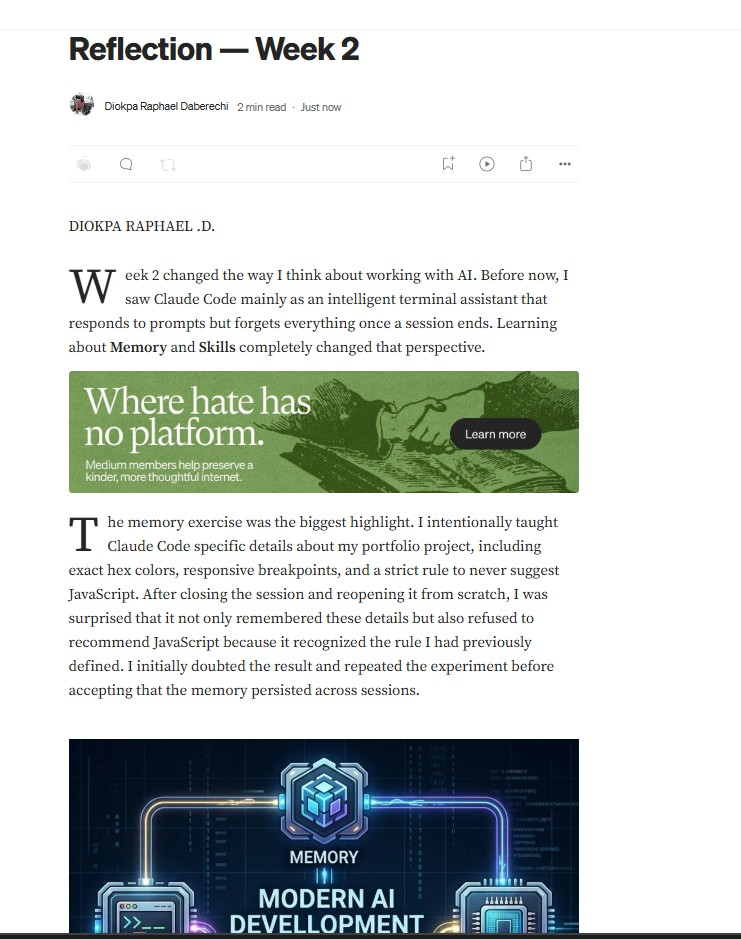
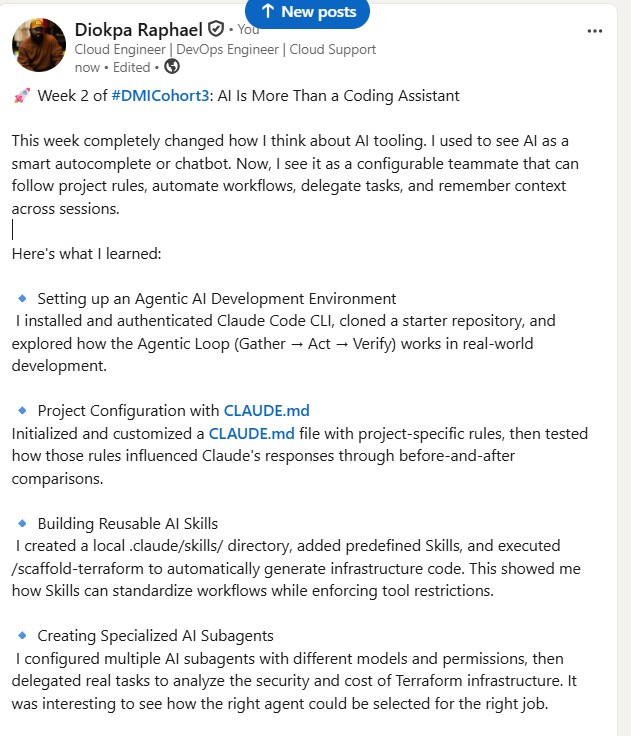

# Assignment 8 — Week 2 Reflection Blog

Part of the DevOps Micro Internship (DMI) Cohort 3 with Agentic AI

---

# Purpose

In this assignment, you will reflect on your Week 2 learning journey and write a short blog capturing your experience working with Agentic AI tools such as Claude Code, Skills, Subagents, MCP, Hooks, Permissions, and Memory.

You will also publish a LinkedIn post summarizing your learning and share both links for evaluation.

---

# Task 1 — Write Your Reflection Blog

## Goal

Write a reflection blog covering your Week 2 learning experience.

### Blog Requirements

Your blog must include:

* Title: **Reflection – Week 2**
* Minimum 300 words
* At least 2–3 topics from Week 2 (Claude Code, Skills, Subagents, MCP, Hooks, Permissions, Memory)
* Honest personal reflection (learning, challenges, mindset)
* One habit/system you plan to implement
* Your full name clearly visible

### Allowed Platforms

You can publish your blog on:

* Hashnode
* Medium
* Dev.to
* LinkedIn Article
* GitHub Markdown file
* Substack

---

### Evidence

#### Screenshot 1 — Blog published and visible




### Submission Field

Blog Link:

https://medium.com/@diokpadaberechi/reflection-week-2-187e74e47497

---

# Task 2 — Create LinkedIn Post

## Goal

Share your Week 2 learning publicly on LinkedIn.

---

### LinkedIn Post Requirements

Your post must include:

* One screenshot from any Week 2 assignment
* Short reflection (what you learned or built)
* Required P.S. line exactly as given below

---

### Required P.S. Line (Must Include Exactly)

> **P.S. This post is part of the DevOps Micro Internship (DMI) with Agentic AI — Cohort 3 — by [Pravin Mishra](https://www.linkedin.com/in/pravin-mishra-aws-trainer/). My graded progress is public: https://dmi.pravinmishra.com/s/YOUR-GITHUB-USERNAME.html · Start your DevOps journey: https://dmi.pravinmishra.com/?utm_source=student&utm_medium=ps-linkedin&utm_campaign=cohort3**

---

### Suggested Hashtags

#DMIByPravinMishra #AgenticAI #ClaudeCode #DevOps #LearningInPublic

---

### Evidence

#### Screenshot 2 — LinkedIn post published



---

### Submission Field

LinkedIn Post Content (copy-paste here):

```

🚀 Week 2 of #DMICohort3: AI Is More Than a Coding Assistant

This week completely changed how I think about AI tooling. I used to see AI as a smart autocomplete or chatbot. Now, I see it as a configurable teammate that can follow project rules, automate workflows, delegate tasks, and remember context across sessions.

Here's what I learned:

🔹 Setting up an Agentic AI Development Environment
 I installed and authenticated Claude Code CLI, cloned a starter repository, and explored how the Agentic Loop (Gather → Act → Verify) works in real-world development.

🔹 Project Configuration with CLAUDE.md
Initialized and customized a CLAUDE.md file with project-specific rules, then tested how those rules influenced Claude's responses through before-and-after comparisons.

🔹 Building Reusable AI Skills
 I created a local .claude/skills/ directory, added predefined Skills, and executed /scaffold-terraform to automatically generate infrastructure code. This showed me how Skills can standardize workflows while enforcing tool restrictions.

🔹 Creating Specialized AI Subagents
 I configured multiple AI subagents with different models and permissions, then delegated real tasks to analyze the security and cost of Terraform infrastructure. It was interesting to see how the right agent could be selected for the right job.

🔹 Connecting AI to External Systems with MCP
 I configured the GitHub Model Context Protocol (MCP) server, securely stored credentials, verified the connection, and successfully queried live GitHub data directly through Claude Code.

🔹 Implementing Safety Controls
 I configured permissions and hooks to prevent destructive commands before execution, demonstrating how AI workflows can be governed with clear guardrails.

🔹 Understanding AI Memory
 One of the biggest takeaways was Claude Code's memory system. I stored structured project knowledge, restarted the session, and confirmed that it could recall and apply that information without me repeating it.

My Biggest Takeaway
AI becomes significantly more valuable when it's given structure. By defining clear instructions, reusable skills, specialized agents, memory, and safety controls, it evolves from simply answering prompts to becoming a reliable development partner.

I'm excited to continue exploring how Agentic AI can improve cloud engineering, DevOps, and infrastructure automation.

#AI #AgenticAI #ClaudeCode #DevOps #CloudEngineering #Terraform #GitHub #Automation #MCP #InfrastructureAsCode #LearningInPublic #DMICohort3

Pravin Mishra Anjana Muthunayake Joy Ukpabi

P.S. This post is part of the DevOps Micro Internship (DMI) with Agentic AI — Cohort 3 — by [Pravin Mishra](https://lnkd.in/e3SJYSBj). My graded progress is public: https://lnkd.in/e336Sk_j Start your DevOps journey: https://lnkd.in/eFAbcnaK


---

### LinkedIn Post Link:

https://www.linkedin.com/posts/diokparaphael_dmicohort3-ai-agenticai-ugcPost-7485220134454898688-8PhS/?utm_source=share&utm_medium=member_desktop&rcm=ACoAABJFGsoB0Tj582Besj5R2uLnB6itVJv47yU 

---

# Submission Instructions

* Blog must be publicly accessible
* LinkedIn post must be visible (public or unlisted where applicable)
* All required fields must be filled
* Screenshot proofs must be added to GitHub repository
* Do not include sensitive information in blog or post

---

# Completion Checklist

* [ ] Blog written with required structure
* [ ] Blog includes at least 2–3 Week 2 topics
* [ ] Blog is publicly accessible
* [ ] LinkedIn post created
* [ ] Required P.S. line included
* [ ] LinkedIn post content copied in submission field
* [ ] Blog link added
* [ ] LinkedIn post link added
* [ ] Screenshots added to GitHub repo

---

# About DMI & CloudAdvisory

DevOps Micro Internship (DMI) is a project-based DevOps program run by Pravin Mishra (The CloudAdvisory), focused on real-world execution, systems thinking, and agentic AI workflows.

It helps learners build strong DevOps foundations through hands-on experience.

---

# Resources

* 🌐 DMI Official Website: [https://dmi.pravinmishra.com?utm_source=github&utm_medium=readme](https://dmi.pravinmishra.com?utm_source=github&utm_medium=readme)
* 🎓 University: [https://university.pravinmishra.com?utm_source=github&utm_medium=readme](https://university.pravinmishra.com?utm_source=github&utm_medium=readme)
* 💬 Discord Community: [https://discord.pravinmishra.com?utm_source=github&utm_medium=readme](https://discord.pravinmishra.com?utm_source=github&utm_medium=readme)
* 📝 Blog: [https://dmi.pravinmishra.com/blog?utm_source=github&utm_medium=readme](https://dmi.pravinmishra.com/blog?utm_source=github&utm_medium=readme)
* ▶️ YouTube Playlist: [https://www.youtube.com/playlist?list=PLFeSNDtI4Cho](https://www.youtube.com/playlist?list=PLFeSNDtI4Cho)
* 🔗 Pravin Mishra (LinkedIn): [https://www.linkedin.com/in/pravin-mishra-aws-trainer/](https://www.linkedin.com/in/pravin-mishra-aws-trainer/)
* 🏢 CloudAdvisory (LinkedIn): [https://www.linkedin.com/company/thecloudadvisory/](https://www.linkedin.com/company/thecloudadvisory/)

