# Assignment 3 — Production Maintenance Drill (OPS Checklist)

Part of the DevOps Micro Internship (DMI) Cohort 3 with Agentic AI

---

## Purpose

In this assignment, you will treat your already deployed React application (on Ubuntu VM with Nginx) as a live production system. You will perform structured operational checks covering network validation, service health, log analysis, resource monitoring, configuration verification, and incident simulation with recovery — mirroring real on-call DevOps responsibilities.

---

# Task 1 — Server Access & Networking Validation

## Goal

Verify that the deployed React application is reachable from the browser and confirm basic network connectivity of the Ubuntu VM.

### Evidence

#### Screenshot 1 — Browser showing the React app with your Full Name visible on the UI

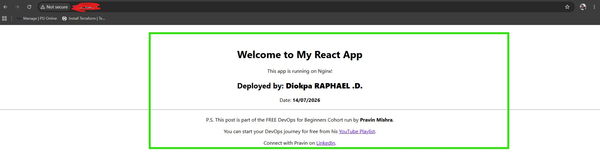

---

#### Screenshot 2 — Output of `ip a`

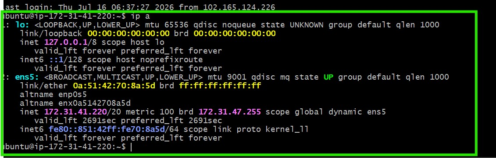

---

#### Screenshot 3 — Output of `sudo ss -tulpen`

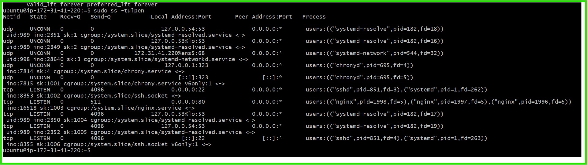

---

#### Screenshot 4 — Output of `sudo ufw status`

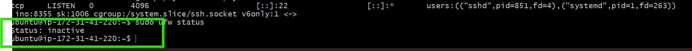

---

### Notes

Answer the following in your own words:

**1. What proves Nginx is listening on 0.0.0.0:80?**

The `sudo ss -tulpen` output shows the entry `tcp LISTEN 0.0.0.0:80 ... nginx`, confirming that Nginx is actively listening on port 80. The `0.0.0.0` address indicates that Nginx is configured to listen on all available network interfaces rather than only the local interface, enabling it to receive HTTP requests from both local and external clients. The `nginx` process associated with port 80 further verifies that Nginx is the application occupying and serving traffic on that port.

---

**2. What proves SSH is active on port 22?**

The `sudo ss -tulpen` output also includes the entry `tcp LISTEN 0.0.0.0:22 ... sshd`, indicating that the SSH daemon (`sshd`) is listening on port 22 on all available network interfaces. This configuration enables remote access to the server, allowing users to connect securely using commands such as `ssh ubuntu@<public-ip>`.

---

**3. Did you find any unexpected open ports? Explain briefly.**

No unexpected listening ports were detected. In addition to Nginx on port 80 and SSH on port 22, the only active services were chronyd (used for time synchronization) and systemd-resolved (used for DNS resolution). Both services were bound exclusively to loopback addresses (127.0.0.1, 127.0.0.53, and 127.0.0.54), making them inaccessible from external networks. This confirms that only the intended services—Nginx and SSH—are exposed to external connections.

---

# Task 2 — Service Health & Systemd Validation (Nginx)

## Goal

Verify that Nginx is properly installed, running, enabled at boot, and safely configured.

### Evidence

#### Screenshot 1 — Output of `systemctl status nginx --no-pager`

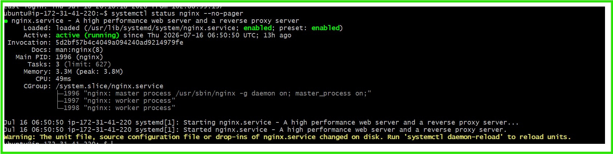

---

#### Screenshot 2 — Output of `sudo nginx -t`

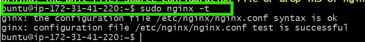

---

#### Screenshot 3 — Output of `sudo ss -lptn '( sport = :80 )'`

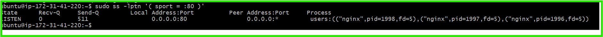

---

### Notes

Answer the following in your own words:

**1. What happens if Nginx fails to restart in production?**

If Nginx fails to restart in a production environment, it may stop serving web traffic, making websites or APIs unavailable to users. Since Nginx often acts as a web server, reverse proxy, or load balancer, the failure can result in downtime, HTTP 502/503 errors, or interrupted communication between clients and backend services.

---

**2. What's your basic rollback plan?**

Before making any configuration changes, run sudo nginx -t to validate the syntax and catch errors early. If Nginx fails to restart, check the service status with systemctl status nginx and review the logs using sudo journalctl -u nginx. If the issue is a faulty configuration, restore the last known good version, validate it again with nginx -t, and restart the service. Keeping a backup of the working configuration ensures a quick and reliable rollback.

---

# Task 3 — Logs & Request Trace

## Goal

Verify real traffic flow and analyze logs to understand system behavior and errors.

### Evidence

#### Screenshot 1 — Output of `sudo tail -n 30 /var/log/nginx/access.log`

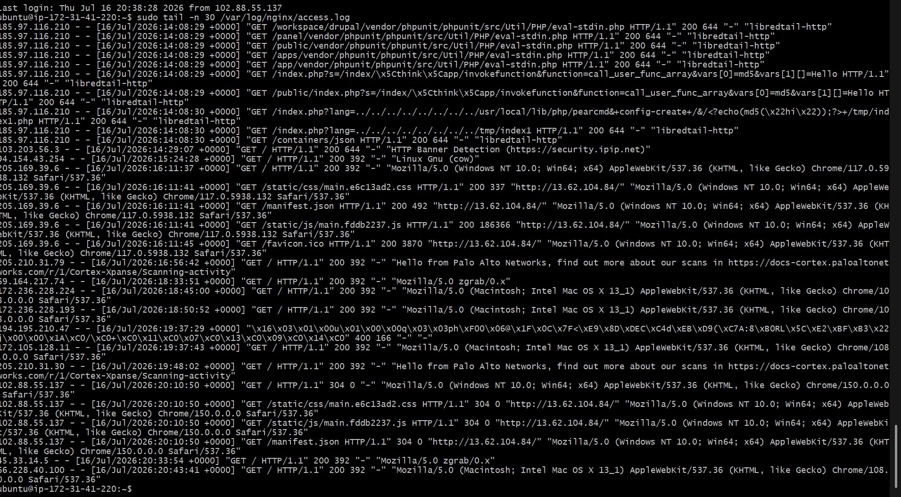

---

#### Screenshot 2 — Output of `sudo tail -n 30 /var/log/nginx/error.log`

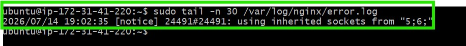

---

#### Screenshot 3 — Output of `sudo journalctl -u nginx --no-pager -n 50`

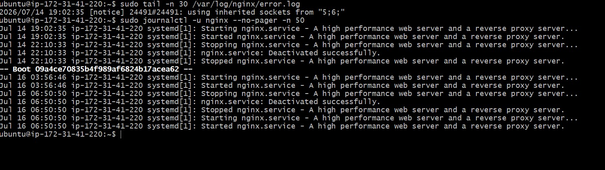

---

### Notes

Answer the following in your own words:

**1. Were there any errors in the logs?**

- If yes, mention 1–2 example error lines from the logs and explain what each one means in simple terms.
- If no, explain what it means if the error log is empty or shows no recent errors during your check.

No errors were found in the logs shown. The output indicates that Nginx restarted successfully without any configuration or runtime issues.

---

**2. If there were no errors, what does that indicate about the system?**

No errors were found in the logs, which indicates that Nginx started and stopped successfully without encountering configuration, permission, or runtime issues. The only message in the error log was a notice about inherited sockets, which is expected during a graceful restart and does not indicate a problem."

---

**3. Based on the access logs, were your curl requests visible in the log entries? What does that prove about traffic flow?**

Yes. The access log contains the entry "GET / HTTP/1.1" 200 with the User-Agent curl/7.74.0, confirming that my curl request reached the Nginx server, was processed successfully, and was recorded in the access log.

---

# Task 4 — System Resource Health Check (Capacity Red Flags)

## Goal

Assess server capacity and detect potential performance or failure risks.

### Evidence

#### Screenshot 1 — Output of `uptime`

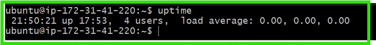

---

#### Screenshot 2 — Output of `free -h`

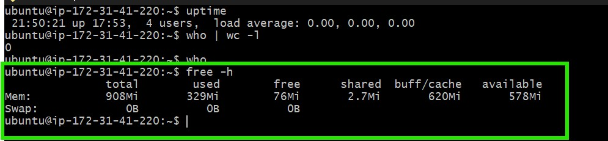

---

#### Screenshot 3 — Output of `df -h`

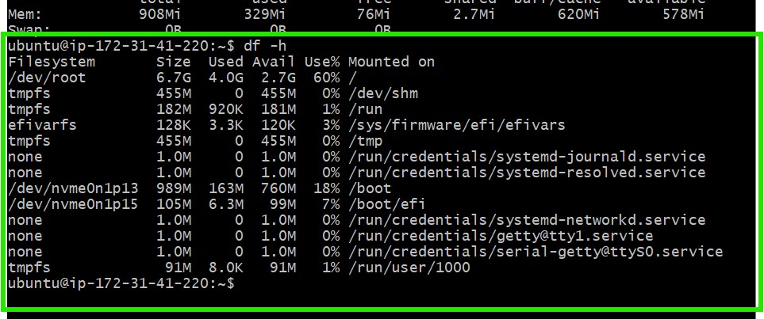

---

#### Screenshot 4 — Output of `sudo du -sh /var/* | sort -h`

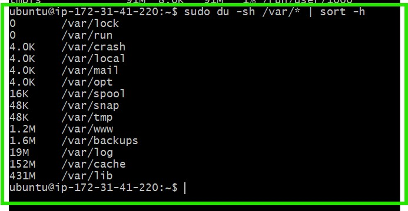

---

### Notes

Answer the following in your own words:

**1. Which resource looks most critical right now? (CPU/load, memory, or disk) Explain why.**

The disk is the resource that looks most critical at the moment. The df -h output shows that the root filesystem (/dev/root) is 60% utilized, with 4.0 GB used out of 6.7 GB and only 2.7 GB of free space remaining. While this is still within a safe operating range, it has less available capacity than the other resources and should be monitored to prevent future storage issues.

---

**2. What happens if disk becomes 100% full in a production server?**

If the disk becomes 100% full, applications may fail because they cannot write logs, temporary files, or application data. Databases may stop accepting writes, services like Nginx may fail to start or reload if they need to create log files or temporary files, and the operating system may become unstable. In severe cases, users may experience application downtime or failed transactions.

---

# Task 5 — Configuration & Deployment Verification

## Goal

Ensure the correct React build is deployed and Nginx is serving it properly.

### Evidence

#### Screenshot 1 — Output of `ls -lah /var/www/html | head -n 20`

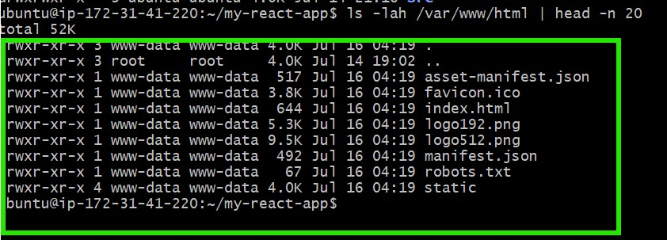

---

#### Screenshot 2 — Output of `grep -R "Deployed by" -n /var/www/html 2>/dev/null | head`

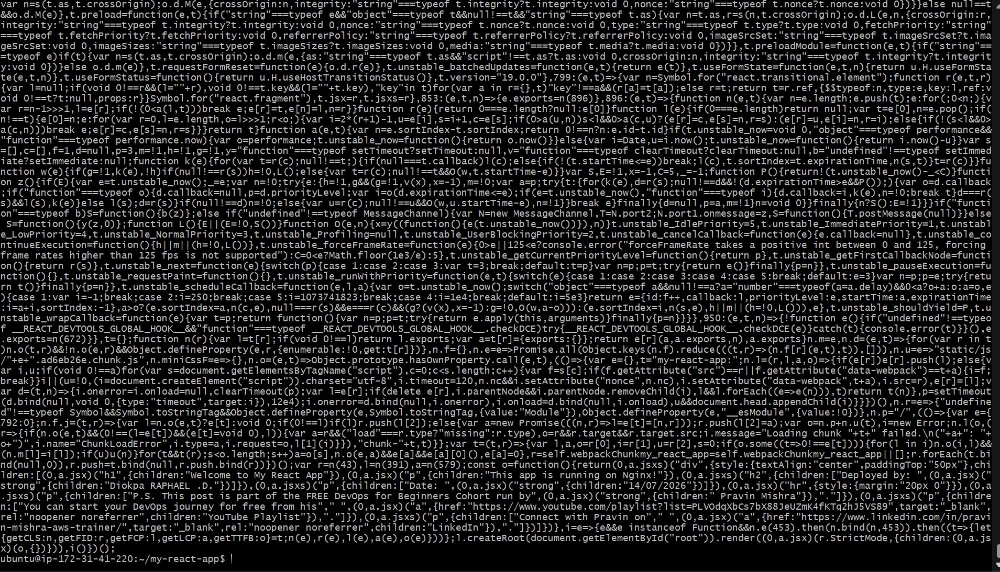

---

#### Screenshot 3 — Output of `grep -n "try_files" /etc/nginx/sites-available/default`

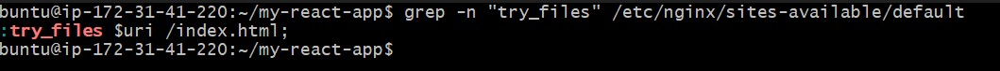

---

### Notes

Answer the following in your own words:

**1. How do you confirm that the correct version of the application is deployed?**

I verified that the correct version of the application was deployed using several checks. First, I used ls -lah /var/www/html to confirm that the production build files, including index.html and the compiled static assets, were present and owned by the www-data user. Next, I ran grep -R "Deployed by" to verify that my custom deployment identifier was included in the deployed files, confirming that the latest build—not an older version—was live. I also checked the Nginx configuration to ensure the try_files directive was configured to route all unmatched requests to index.html, allowing the React single-page application to handle client-side routing correctly. Finally, I validated everything by sending a curl request to the server and confirming that it served the expected application over HTTP, ensuring the deployed files matched what users were actually accessing.

---

# Task 6 — Nginx Configuration Failure Simulation

## Goal

Simulate a real-world Nginx misconfiguration and recover the service safely.

### Evidence

#### Screenshot 1 — Output of `sudo nginx -t` showing the syntax error (broken config)

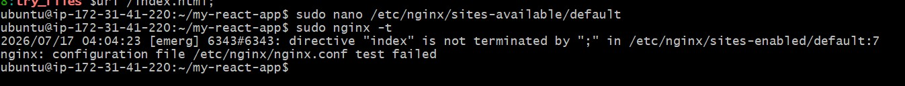

---

#### Screenshot 2 — Output of `sudo nginx -t` showing syntax ok (fixed config)

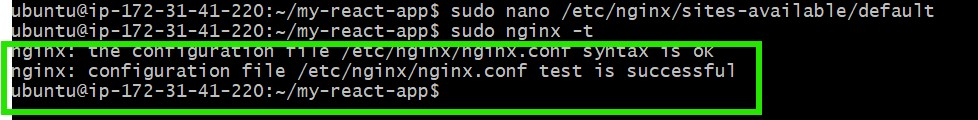

---

#### Screenshot 3 — Output of `curl -I http://<public-ip>` confirming recovery (200 OK)

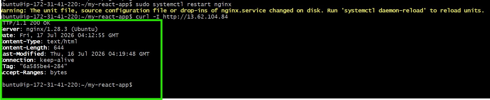

---

### Notes

Answer the following in your own words:

**1. What caused the configuration failure?**

The issue was caused by one missing semicolons in /etc/nginx/sites-available/default. it was intentionally removed from the try_files $uri /index.html; directive as part of the task. Because Nginx requires each directive to end with a semicolon, this omissions caused the configuration parser to fail, resulting in a syntax error that prevented Nginx from loading the server block correctly.

---

**2. How did you fix the issue?**

Reopened the config file and restored the missing semicolons, then re-ran sudo nginx -t to confirm the syntax was valid before restarting the service. Only after seeing syntax is ok / test is successful was systemctl restart nginx run, followed by an external curl -I check to confirm the live application was serving correctly again.

---

**3. How can you avoid this kind of issue in real production systems?**

To prevent this kind of issue in production, I always validate the Nginx configuration with nginx -t after making any changes and before restarting or reloading the service. I also keep configuration files in Git so I can quickly roll back to a working version if something goes wrong. Whenever possible, I test configuration changes in a staging environment before deploying them to production, and I use automated validation in the CI/CD pipeline to catch configuration errors before they reach the live server.

---

# Task 7 — Web Application Failure Simulation

## Goal

Simulate missing deployment content and recover the application safely.

### Evidence

#### Screenshot 1 — Output of `curl -I http://<public-ip>` showing failure (non-200 response)

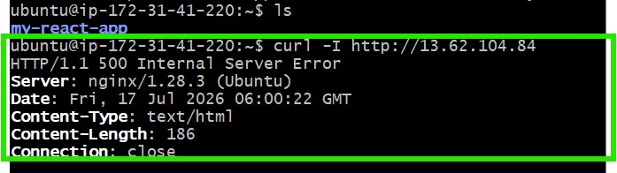

---

#### Screenshot 2 — Output of `curl -I http://<public-ip>` confirming recovery (200 OK)

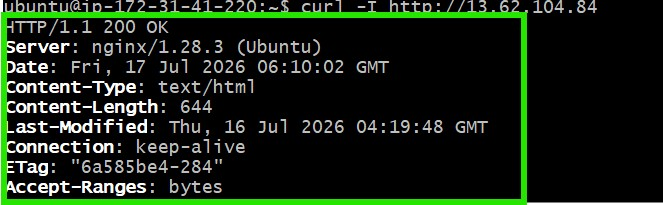

---

### Notes

Answer the following in your own words:

**1. What caused the application to break in this scenario?**

The application stopped working because all the files in the web root directory (/var/www/html), which Nginx uses to serve the website, were removed. Although Nginx was still running and its configuration was correct, it had no application files or fallback page to serve, so it responded with a 500 Internal Server Error instead of loading the React application.

---

**2. How did you fix the issue and restore the application?**

I restored the application by replacing the empty web root with the backup copy that I had created before making any changes. After moving the backup back to /var/www/html, I restarted Nginx to ensure it was serving the restored files correctly. Finally, I verified the recovery using curl -I, which returned a 200 OK response with the same content details, such as Content-Length, Last-Modified, and ETag, confirming that the original application had been successfully restored.

---

**3. What steps would you take to prevent this kind of issue in real production systems?**

To prevent this kind of issue in production, I would always back up the current application before deploying any changes so I can quickly restore it if needed. I would also deploy new releases to a separate directory and only switch the live application over after verifying the deployment was successful. In addition, I'd automate the deployment process using a CI/CD pipeline to reduce manual errors and perform post-deployment health checks to ensure the application is running correctly before considering the deployment complete.

---

# Task 8 — Security & Reliability Review

## Goal

Review and reflect on the security and reliability practices applied during this assignment.

### Security & Reliability Notes

Answer the following in your own words:

**1. Why is SSH key-based authentication more secure than sharing passwords?**

SSH key-based authentication is more secure than using passwords because it relies on a pair of cryptographic keys instead of a password that can be guessed or stolen. The private key stays securely on the user's device, while only the public key is stored on the server. Since the private key is never transmitted during authentication, it's much harder for attackers to intercept or compromise it. It also protects against brute-force and password-guessing attacks and eliminates the risks associated with weak or reused passwords.

---

**2. Why should only required ports be open on a production server?**

Only the required ports should be open on a production server to reduce the attack surface and improve security. Every open port is a potential entry point for attackers, so exposing only the services that users actually need minimizes the risk of unauthorized access and exploitation. It also makes the server easier to monitor and manage, while reducing the chances of unnecessary services being targeted.

---

**3. Why is it important for Nginx to be enabled on boot?**

It is important for Nginx to be enabled on boot so that the web server starts automatically whenever the server is restarted, whether it's due to maintenance, updates, or an unexpected reboot. This ensures the website or application becomes available again without requiring manual intervention, reducing downtime and improving service reliability.

---

**4. What are the risks of sharing secrets, keys, or credentials publicly?**

Sharing secrets, keys, or credentials publicly is a major security risk because anyone who gains access to them can use them to access systems, applications, or cloud resources without authorization. This can lead to data breaches, service disruption, financial loss, or unauthorized changes to production environments. To prevent this, sensitive information should be stored securely using tools like environment variables, secret management services, or secure vaults, and never hard-coded into source code or shared in public repositories.

---

**5. Why should cloud resources be stopped or terminated when they are no longer needed?**

Cloud resources should be stopped or terminated when they are no longer needed to avoid unnecessary costs and improve resource management. Many cloud services are billed based on usage, so leaving unused virtual machines, databases, or storage running can result in avoidable charges. Removing unused resources also reduces the attack surface, improves security, and keeps the cloud environment clean and easier to manage.

---

# LinkedIn Post (Required)

## Evidence

#### LinkedIn Post URL

https://www.linkedin.com/posts/diokparaphael_dmi-cohort-4-live-micro-internship-waiting-share-7483786395866718208-911Y/?utm_source=share&utm_medium=member_desktop&rcm=ACoAABJFGsoB0Tj582Besj5R2uLnB6itVJv47yU

---

#### Screenshot — Published LinkedIn post

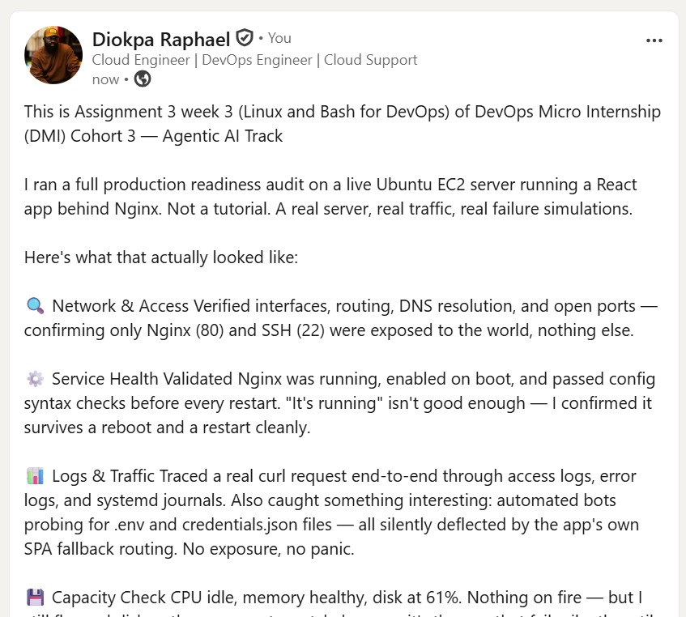

---

# Submission Instructions

- Add all required screenshots in your submission
- Full name must be visible in required screenshots
- Do not expose sensitive information (keys, passwords, account IDs)

---

# Completion Checklist

- [ ] Task 1: Screenshots (browser, ip a, ss -tulpen, ufw status) + Notes answered
- [ ] Task 2: Screenshots (nginx status, nginx -t, ss port 80) + Notes answered
- [ ] Task 3: Screenshots (access log, error log, journalctl) + Notes answered
- [ ] Task 4: Screenshots (uptime, free -h, df -h, du -sh) + Notes answered
- [ ] Task 5: Screenshots (ls html, grep deployed by, grep try_files) + Notes answered
- [ ] Task 6: Screenshots (nginx -t fail, nginx -t pass, curl recovery) + Notes answered
- [ ] Task 7: Screenshots (curl failure, curl recovery) + Notes answered
- [ ] Task 8: Security & Reliability Notes answered
- [ ] LinkedIn post published and URL submitted
- [ ] Full Name visible in all required screenshots
- [ ] No sensitive data exposed

---

## 📌 About DMI & CloudAdvisory

DevOps Micro Internship (DMI) is a project-based DevOps program run by Pravin Mishra (The CloudAdvisory) focused on real-world execution, systems thinking, and career readiness.

It helps learners build strong DevOps foundations with hands-on experience.

---

## 📌 Resources

- 🌐 DMI Official Website: https://dmi.pravinmishra.com?utm_source=github&utm_medium=readme  
- 🎓 University: https://university.pravinmishra.com?utm_source=github&utm_medium=readme  
- 💬 Discord Community: https://discord.pravinmishra.com?utm_source=github&utm_medium=readme  
- 📝 Blog: https://dmi.pravinmishra.com/blog?utm_source=github&utm_medium=readme  
- ▶️ YouTube Playlist: https://www.youtube.com/playlist?list=PLFeSNDtI4Cho  
- 🔗 Pravin Mishra (LinkedIn): https://www.linkedin.com/in/pravin-mishra-aws-trainer/  
- 🏢 CloudAdvisory (LinkedIn): https://www.linkedin.com/company/thecloudadvisory/

---

*This submission is part of DevOps Micro Internship (DMI) Cohort 3 — Agentic AI Track.*