# Assignment 5 — Bash Script Automation Drill (OPS Checklist)

Part of the DevOps Micro Internship (DMI) Cohort 3 with Agentic AI

---

## Purpose

In this assignment, you will practice Bash scripting by building a series of small automation scripts covering environment setup, variables, arrays, loops, file conditionals, if-else logic, and functions. These scripts form the foundation of real-world Linux automation used in DevOps, cloud, and production support environments.

---

# Task 1 — Bash Environment & Workspace Setup

## Goal

Verify that Bash is available on your system and create a clean workspace for this assignment.

### Evidence

#### Screenshot 1 — Output of `echo $SHELL` and `bash --version`

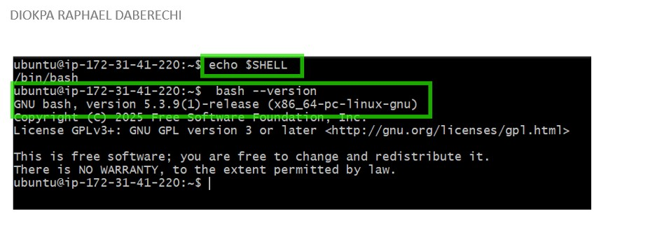

---

#### Screenshot 2 — Output of `pwd` and `ls -lah` showing the scripts directory

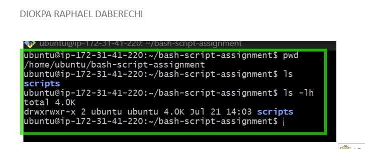

---

### Notes

Answer the following in your own words:

**1. What is Bash?**

Bash which stands for Bourne Again SHell,thi is a command-line shell and scripting language used on Linux, macOS, and Unix systems. It's the program that reads the commands you type and tells the operating system what to do.

---

**2. What is the difference between shell and Bash?**

A shell is any program that provides a command-line interface between the user and the operating system's kernel. It's the category, not a specific product. Its job is: read what you type, interpret it, and tell the OS what to do while Bash is a particular type of shell.

Bash is just one implementation of the concept of Shell, one of the most popular on Linux/macOS.

---

**3. Why is it important to confirm the Bash version before writing scripts?**

This is because newer bash versions add features that simply don't exist in older ones. 

For example:

Associative arrays (declare -A) require bash 4.0+
The &>> append-and-redirect operator needs bash 4.0+
Certain string manipulation features (like ${var,,} for lowercasing) also need 4.0+

If you write a script using these features and someone runs it on an older bash, it'll either bring an error or silently behave differently.

---

# Task 2 — Your First Bash Script

## Goal

Create your first Bash script, make it executable, and run it from the terminal.

### Evidence

#### Screenshot 1 — Content of `first-script.sh`

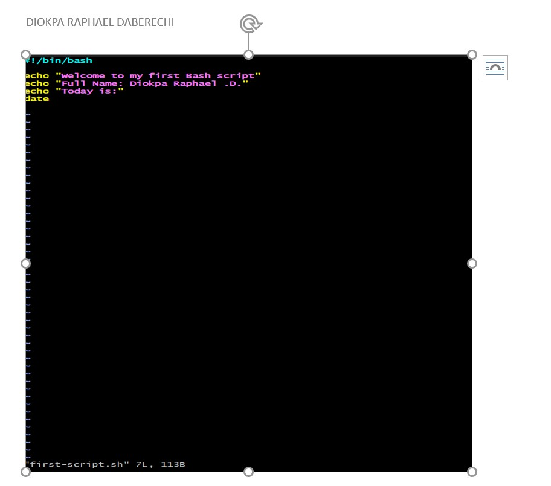

---

#### Screenshot 2 — Output of `./first-script.sh`

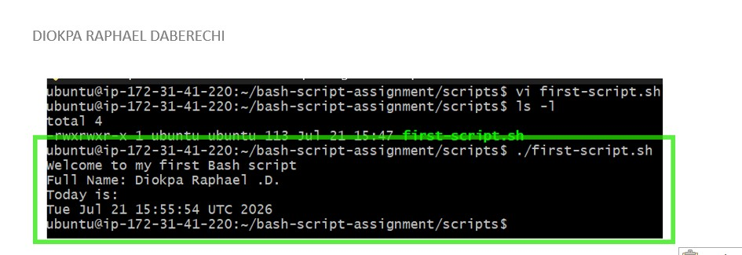

---

#### Screenshot 3 — Output of `ls -l first-script.sh` showing executable permission

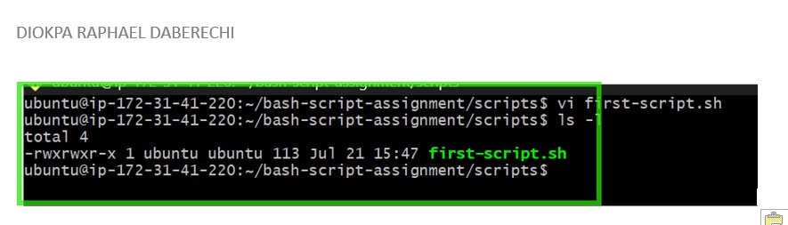

---

### Notes

Answer the following in your own words:

**1. What is the purpose of `#!/bin/bash`?**

#!/bin/bash tells the operating system to run every script below with bash

---

**2. Why do we use `chmod +x` before running a script?**

This is because when you create a new script (e.g., vi first-script.sh), it's created with read and write permissions by default, but not execute, chmod +x is used to the execute permission to the script

---

**3. What is the difference between running a script using `./script.sh` and `bash script.sh`?**

`./script.sh` tells the kernel itsef to execute the file as a program and the file must have execute permission (chmod +x first-script.sh), while `bash script.sh` asks bash (which we already have permission to run, since it's a system program) to read the file and interpret its contents as commands.No execute permission needed on the script as we are not asking the OS to run the file directly, we are asking bash to treat it as input, similar to feeding it a text file

---

# Task 3 — Variables: User Information Script

## Goal

Use variables to store and display user-related information.

### Evidence

#### Screenshot 1 — Content of `user-info.sh`

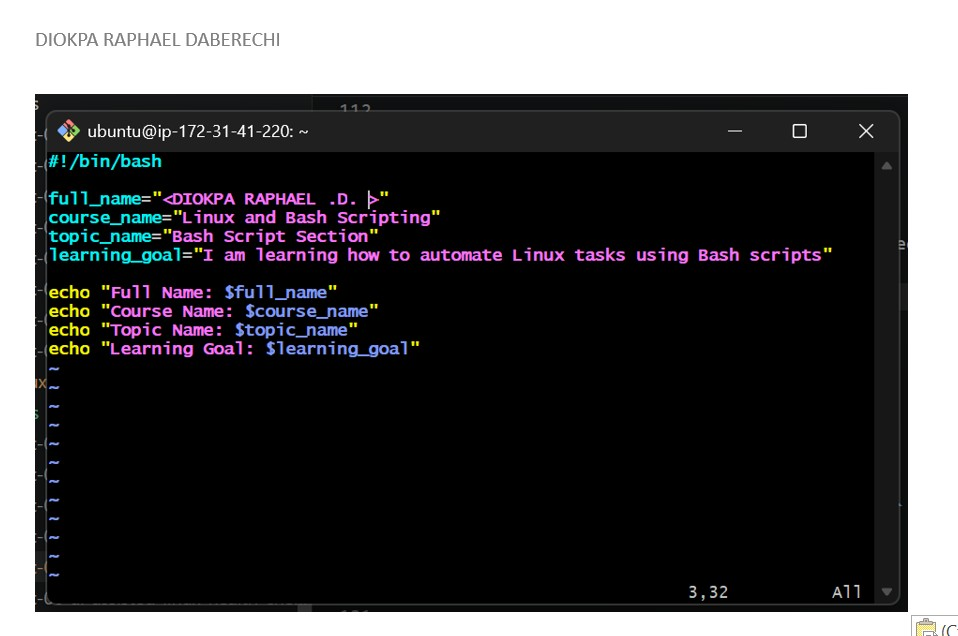

---

#### Screenshot 2 — Output of `./user-info.sh`

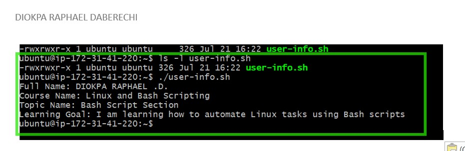

---

### Notes

Answer the following in your own words:

**1. What is a variable in Bash?**

A variable in Bash is a named storage location that holds a value — text, a number, or command output.

---

**2. Why should we avoid spaces around the `=` sign when creating variables?**

This is because Bash treats = with spaces as a command with arguments, not variable assignment.

---

**3. How do you access the value stored inside a Bash variable?**

Put a $ in front of the variable name or use ${name} for clarity/safety

---

# Task 4 — Arrays & Loops: Tools Checklist Script

## Goal

Use arrays and loops to print a checklist of tools used in Bash scripting.

### Evidence

#### Screenshot 1 — Content of `tools-checklist.sh`

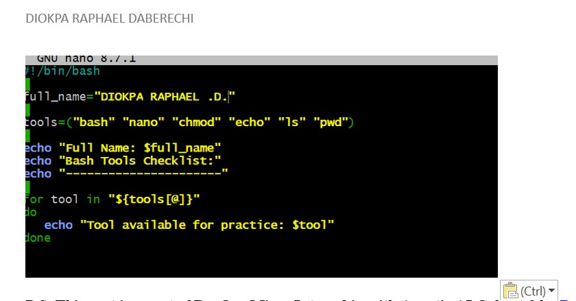

---

#### Screenshot 2 — Output of `./tools-checklist.sh`

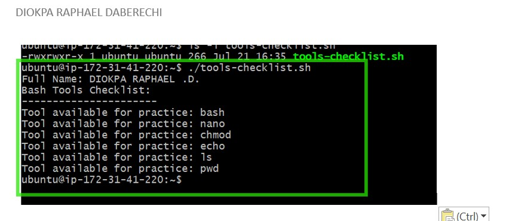

---

### Notes

Answer the following in your own words:

**1. What is an array in Bash?**

An array in Bash is a variable that holds multiple values (a list) instead of just one, accessed by index.

---

**2. Why are arrays useful in scripts?**

Arrays let you store a list of related items in one variable and loop through them, instead of writing repetitive code for each item separately.

---

**3. What does `"${tools[@]}"` mean?**

tools[@] — refers to all elements of the tools array (as opposed to tools[0] for just one element)

---

**4. What is the purpose of the `for` loop in this script?**

A for loop lets a script repeat the same action once for each item in a list — instead of writing that action out manually, over and over, for every item. It goes through each value in the tools array one by one. 

---

# Task 5 — Loops: Number Counter Script

## Goal

Use loops to repeat a task multiple times.

### Evidence

#### Screenshot 1 — Content of `counter.sh`

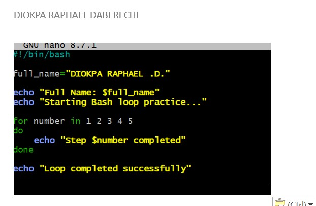

---

#### Screenshot 2 — Output of `./counter.sh`

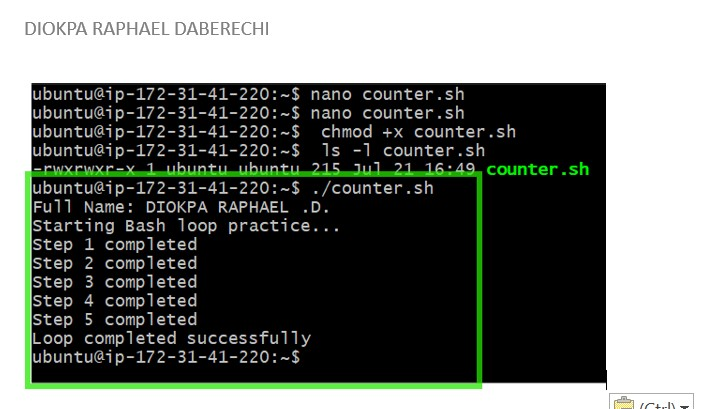

---

### Notes

Answer the following in your own words:

**1. What is a loop?**

A loop is a way to repeat a block of code multiple times instead of writing it out over and over by hand.

---

**2. Why do we use loops in Bash scripting?**

We use loops in Bash to avoid repeating code and to make scripts scale automatically to any amount of data — a fixed number of lines can process 3 items or 3,000 without changes.

---

**3. How many times did the loop run in your script?**

The Loop ran 5 times, it ran once for each number

---

**4. What would you change if you wanted the loop to run 10 times?**

I would add the numbers 6 to 10 to the for loop:
for number in 1 2 3 4 5 6 7 8 9 10
do
   	echo "Step $number completed"
done

---

# Task 6 — Files & Conditionals: File Validation Script

## Goal

Use file checks and conditionals to verify whether files and directories exist.

### Evidence

#### Screenshot 1 — Output of `ls -lah ../test-folder`

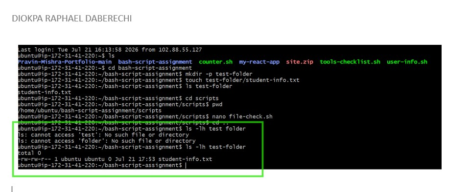

---

#### Screenshot 2 — Content of `file-check.sh`

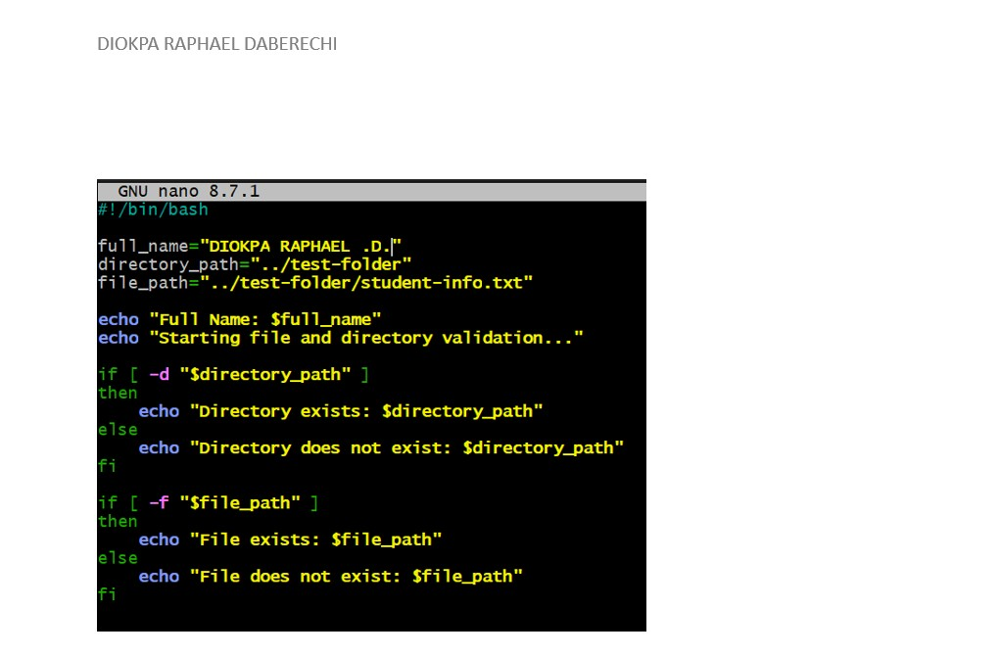

---

#### Screenshot 3 — Output of `./file-check.sh`

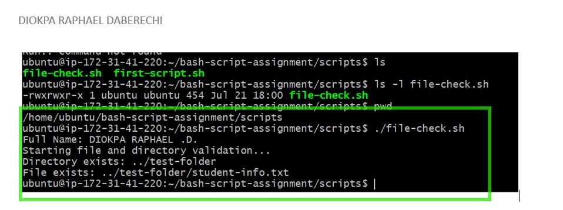

---

### Notes

Answer the following in your own words:

**1. What does `-d` check in Bash?**

-d checks whether a given path exists and is a directory — used inside [ ] or [[ ]] conditional tests. If the directory exists, the condition becomes true.

---

**2. What does `-f` check in Bash?**

-f checks whether a given path exists and is a regular file (not a directory) — used inside [ ] or [[ ]] conditional tests. 

---

**3. Why should file and directory paths be stored in variables?**

This is mainly for mainly for maintainability, readability, and fewer bugs — using the same hardcoded path repeatedly is fragile and prone to error.

---

**4. What happens if the file does not exist?**

it just returns false and the following message will be displayed: File does not exist: ../test-folder/student-info.txt

---

# Task 7 — Conditionals: Pass or Retry Script

## Goal

Use if-else conditionals to make decisions based on a variable value.

### Evidence

#### Screenshot 1 — Content of `score-check.sh` with `score=85`

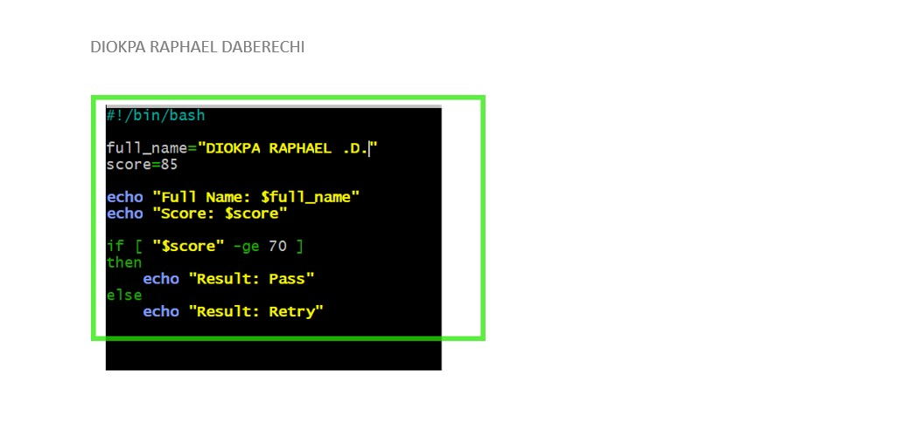

---

#### Screenshot 2 — Output showing `Result: Pass`

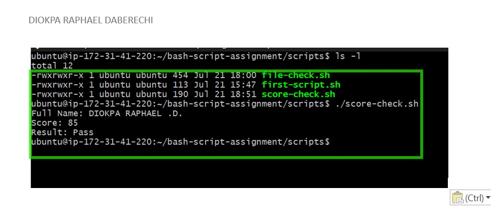

---

#### Screenshot 3 — Content of `score-check.sh` with `score=55`

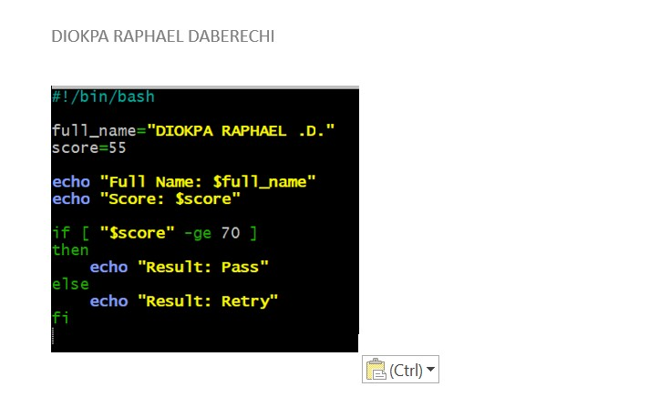

---

#### Screenshot 4 — Output showing `Result: Retry`

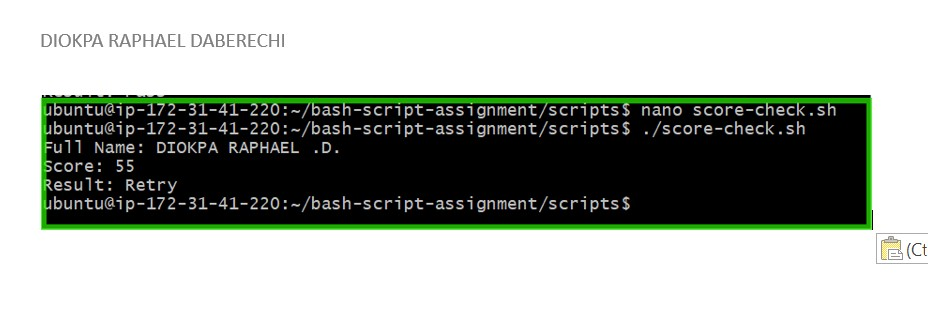

---

### Notes

Answer the following in your own words:

**1. What is the purpose of if-else in Bash?**

if-else lets a script make a decision — run one set of commands if a condition is true, and a different set if it's false — instead of always doing the same thing regardless of the situation.

---

**2. What does `-ge` mean?**

-ge means Greater then or Equal to

---

**3. Why should conditions be tested with different values?**

Because testing a condition with only one value tells you nothing about whether your logic actually handles the situations it's supposed to catch.

---

**4. How can conditionals help in automation scripts?**

Conditionals let automation scripts make decisions based on the actual state of the system, rather than assuming a fixed outcome every time. For example, a script can check whether a service is running, a file exists, or a disk is nearly full — then take the appropriate action depending on what it finds.

---

# Task 8 — Functions: Final Bash Automation Script

## Goal

Create a final Bash script using functions to organize reusable code.

### Evidence

#### Screenshot 1 — Content of `final-automation.sh`

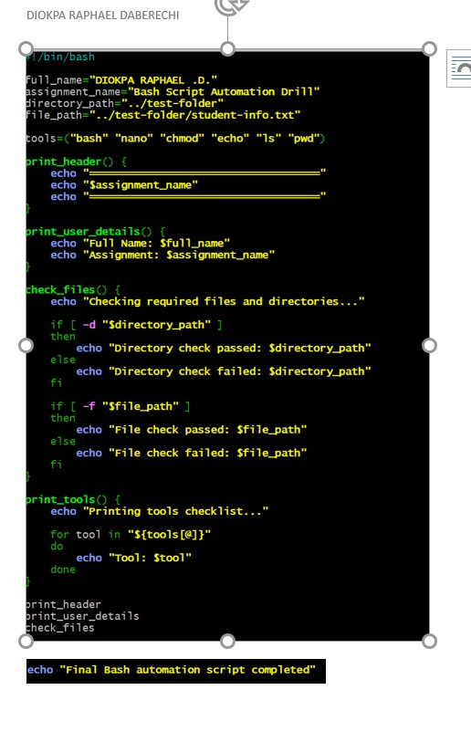

---

#### Screenshot 2 — Output of `./final-automation.sh`

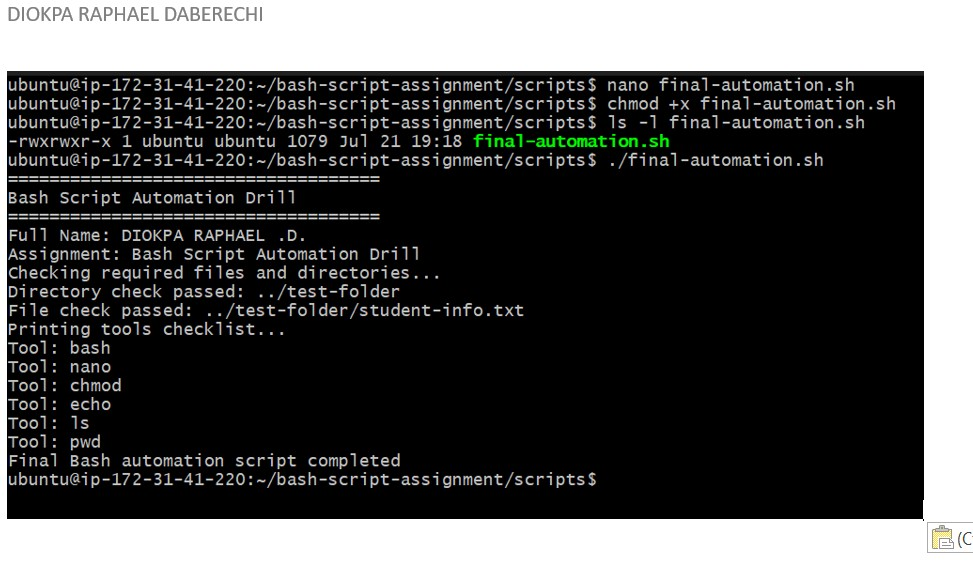

---

#### Screenshot 3 — Output of `ls -lah` showing all created scripts

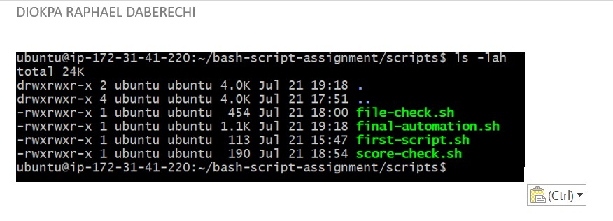

---

### Notes

Answer the following in your own words:

**1. What is a function in Bash?**

A function in Bash is a named block of code that you define once and can call (run) multiple times — useful for grouping repeated logic instead of duplicating it.

---

**2. Why are functions useful in scripts?**

Functions let you write logic once and reuse it anywhere in the script, instead of copy-pasting the same block of commands every time you need it.

---

**3. Which functions did you create in this script?**

I created four functions:

print_header prints the assignment header.
print_user_details prints my full name and the assignment name.
check_files checks whether the required directory and file exist.
print_tools uses a loop to print each tool stored in the array.

---

**4. How does this final script combine variables, arrays, loops, conditionals, files, and functions?**

The script uses variables to store my name, the assignment name, and the required paths. It uses an array to store the tool names and a loop to print them one by one.

It uses if-else conditionals with -d and -f to check the required directory and file. Finally, the related commands are organized into functions, and those functions are called in the correct order to run the complete automation script.

---

# LinkedIn Post (Required)

## Evidence

#### LinkedIn Post URL

Paste your LinkedIn post URL here:

https://www.linkedin.com/posts/diokparaphael_dmi-devops-micro-internship-with-agentic-share-7485420084492959744-pTrt/?utm_source=share&utm_medium=member_desktop&rcm=ACoAABJFGsoB0Tj582Besj5R2uLnB6itVJv47yU

---

#### Screenshot — Published LinkedIn post

---

# Submission Instructions

- Add all required screenshots in your submission
- Full name must be visible in required screenshots
- All script files must be created and run successfully
- Required notes must be answered clearly for every task
- Do not expose sensitive information (keys, passwords, credentials)

---

# Completion Checklist

- [ ] Task 1: Environment setup verified, workspace created (Screenshots 1–2, Notes answered)
- [ ] Task 2: First script created, executed, permissions verified (Screenshots 1–3, Notes answered)
- [ ] Task 3: Variables script created and run (Screenshots 1–2, Notes answered)
- [ ] Task 4: Arrays and loops script created and run (Screenshots 1–2, Notes answered)
- [ ] Task 5: Counter loop script created and run (Screenshots 1–2, Notes answered)
- [ ] Task 6: File validation script created and run (Screenshots 1–3, Notes answered)
- [ ] Task 7: Pass/Retry conditional script tested with both values (Screenshots 1–4, Notes answered)
- [ ] Task 8: Final automation script created and run (Screenshots 1–3, Notes answered)
- [ ] All scripts run without errors
- [ ] Full Name visible in all required screenshots
- [ ] LinkedIn post published and URL submitted
- [ ] No sensitive data exposed

---

## 📌 About DMI & CloudAdvisory

DevOps Micro Internship (DMI) is a project-based DevOps program run by Pravin Mishra (The CloudAdvisory) focused on real-world execution, systems thinking, and career readiness.

It helps learners build strong DevOps foundations with hands-on experience.

---

## 📌 Resources

- 🌐 DMI Official Website: https://pravinmishra.com/dmi  
- 🎓 DevOps for Beginners (Udemy): https://www.udemy.com/course/devops-for-beginners-docker-k8s-cloud-cicd-4-projects/  
- 🎓 Agentic AI DevOps with Claude Code: https://www.udemy.com/course/ultimate-agentic-ai-devops-with-claude-code/  
- 🎓 DevOps with Claude Code: Terraform, EKS, ArgoCD & Helm: https://www.udemy.com/course/devops-with-claude-code-terraform-eks-argocd-helm/  
- ▶️ YouTube Playlist: https://www.youtube.com/playlist?list=PLFeSNDtI4Cho  
- 🔗 Pravin Mishra (LinkedIn): https://www.linkedin.com/in/pravin-mishra-aws-trainer/  
- 🏢 CloudAdvisory (LinkedIn): https://www.linkedin.com/company/thecloudadvisory/

---

*This submission is part of DevOps Micro Internship (DMI) Cohort 3 — Agentic AI Track.*