# Assignment 6 — Build an AI-Assisted Linux Health Check (AI-Assisted Linux Incident Triage)

Part of the DevOps Micro Internship (DMI) Cohort 3 with Agentic AI

---

## Purpose

In this assignment, you will build a read-only Bash triage script that checks the health of your Ubuntu server and Nginx application, connect it to Claude Code as a reusable `/linux-triage` skill, simulate a controlled Nginx incident, use the skill to gather and analyze evidence, recover the service manually, and verify recovery. The workflow follows the Agentic Loop: Gather → Analyze → Human Act → Verify.

---

# Task 1 — Confirm the Healthy Baseline and Create the Workspace

## Goal

Confirm that Nginx and the React application are healthy before building the automation.

### Evidence

#### Screenshot 1 — Output of `systemctl is-active nginx`, `ss -ltn | grep ':80'`, and `curl -I http://localhost`

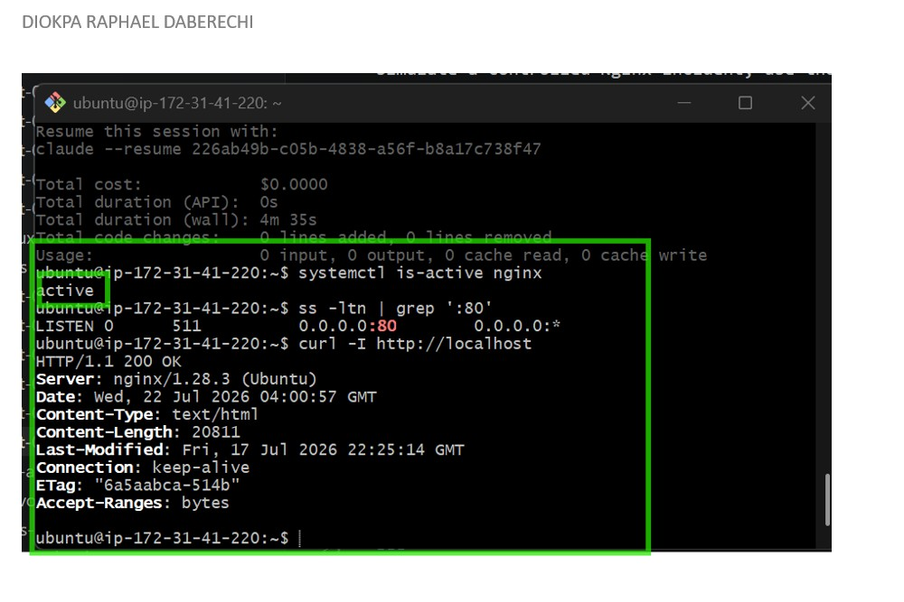

---

#### Screenshot 2 — Output of `pwd` and `find . -maxdepth 4 -type d | sort` showing the workspace folder structure

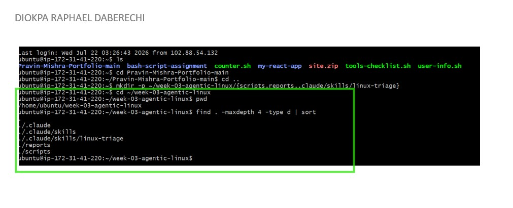

---

### Notes

Answer the following in your own words:

**1. What proves that Nginx is running?**

Running the command systemctl is-active nginx, it returns active. This confirms that Nginx is running.

---

**2. What proves that the server is listening for HTTP traffic?**

The output of ss -ltn | grep ':80' shows that port 80 is listening. This means the server is ready to receive HTTP requests.

---

**3. Why must you capture a healthy baseline before simulating an incident?**

I confirm everything is running as expected. Then I simulate the incident and compare the broken state against the healthy one to pinpoint exactly what changed. After applying the fix, I check again to make sure everything has truly returned to normal.

---

# Task 2 — Create Project Context and Safety Rules in CLAUDE.md

## Goal

Tell Claude exactly what this project does and what it is not allowed to do.

### Evidence

#### Screenshot 3 — CLAUDE.md open in VS Code showing all four sections (Project Overview, Incident Workflow, Safety Rules, Output Rules)

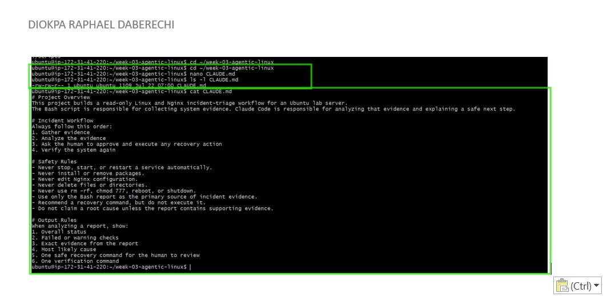
---

### Notes

Answer the following in your own words:

**1. Why should Claude receive project-specific operational rules?**

Claude needs project-specific operational rules so it knows what the project does and which step to follow,because without them, Claude falls back on generic best practices that may not match how the project actually works — and generic advice can be wrong in ways that break things silently.

---

**2. Why is the human required to execute the recovery command?**

Because recovery actions are often destructive or high-impact — restoring files, restarting services, overwriting a broken state — and an AI acting autonomously on those without oversight is a real risk if its judgment is wrong

---

**3. Which rule prevents Claude from making an unsupported diagnosis?**

The rule “Do not claim a root cause unless the report contains supporting evidence” prevents Claude from giving a diagnosis that is not supported by the report.

---

# Task 3 — Use Agentic AI to Plan Before Writing the Script

## Goal

Use Claude Code to inspect the environment and produce a read-only plan before creating any Bash code.

### Evidence

#### Screenshot 4 — Claude Code showing the five-check plan and read-only inspection results

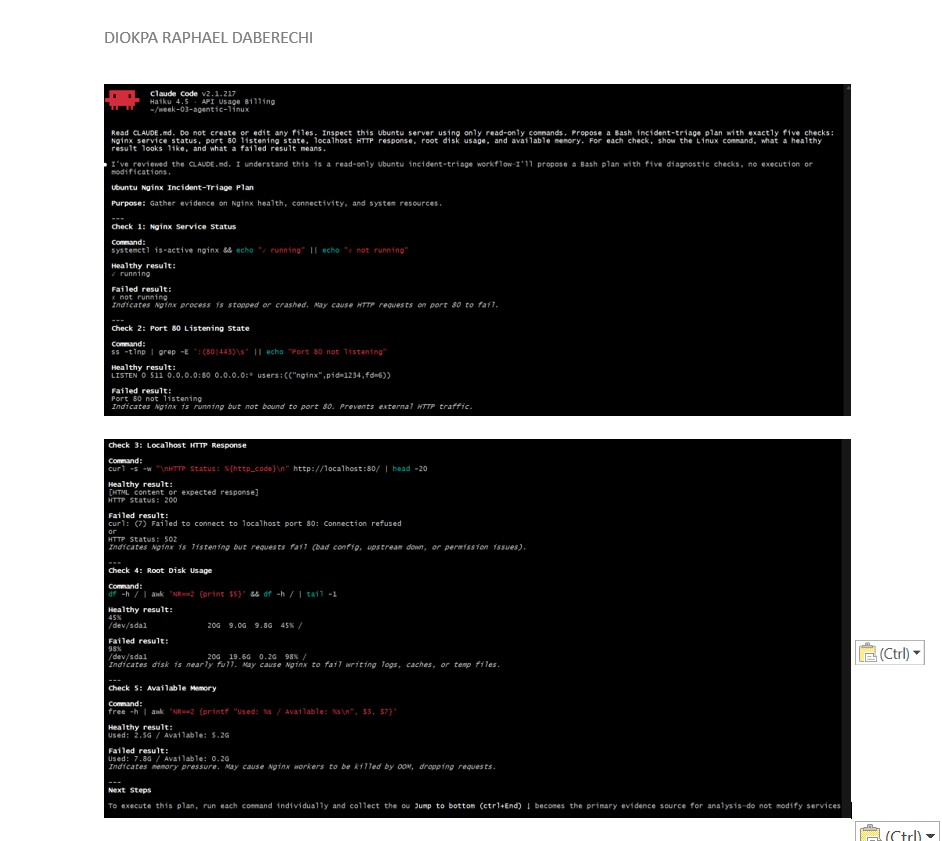

---

### Notes

Answer the following in your own words:

**1. Which part of this task represents the Gather phase?**

The Gather phase begins with a read-only inspection of the Ubuntu server. During this stage, Claude executes commands to collect information about the Nginx service, port 80, HTTP response, disk usage, and available memory.

---

**2. Did Claude follow the instruction not to create files? How did you verify this?**

Yes, Claude followed the instruction and only performed read-only checks. I verified this by listing the files in the workspace and running the command find . -maxdepth 4 -type f | sort
and confirming that no Bash script or other new file was created.

---

**3. Why is planning before coding useful in DevOps automation?**

Planning allows me to determine what the script should verify and how to interpret each outcome before I start coding. It also helps me identify potential gaps or risks early, rather than discovering them after the script has been written.

---

# Task 4 — Build the Linux Triage Bash Script

## Goal

Create one Bash script that gathers consistent Linux and Nginx health evidence.

### Evidence

#### Screenshot 5 — Top section of `linux-triage.sh` showing variables, thresholds, and the checks array

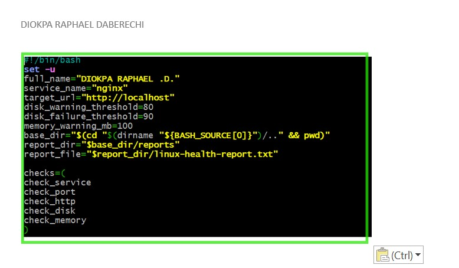

---

#### Screenshot 6 — Middle section showing check functions and conditionals

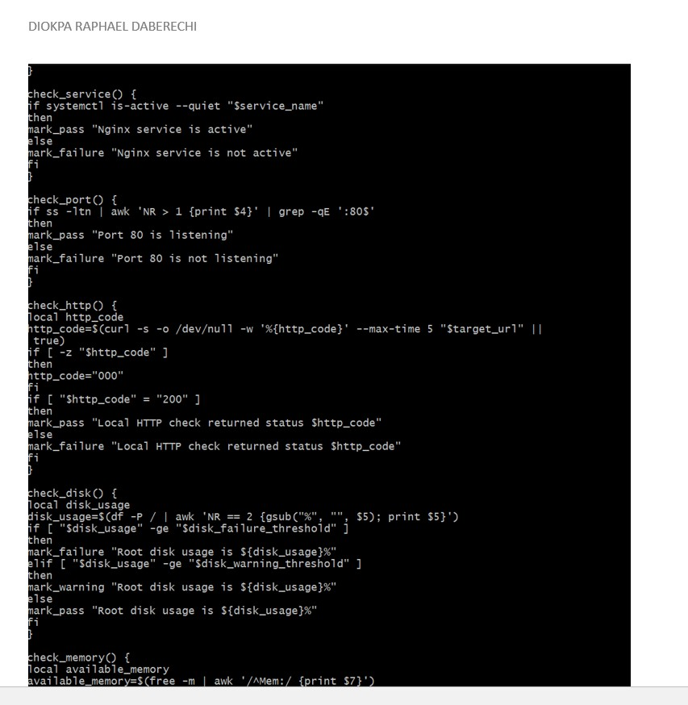

---

#### Screenshot 7 — Bottom section showing the loop, summary function, and exit behavior

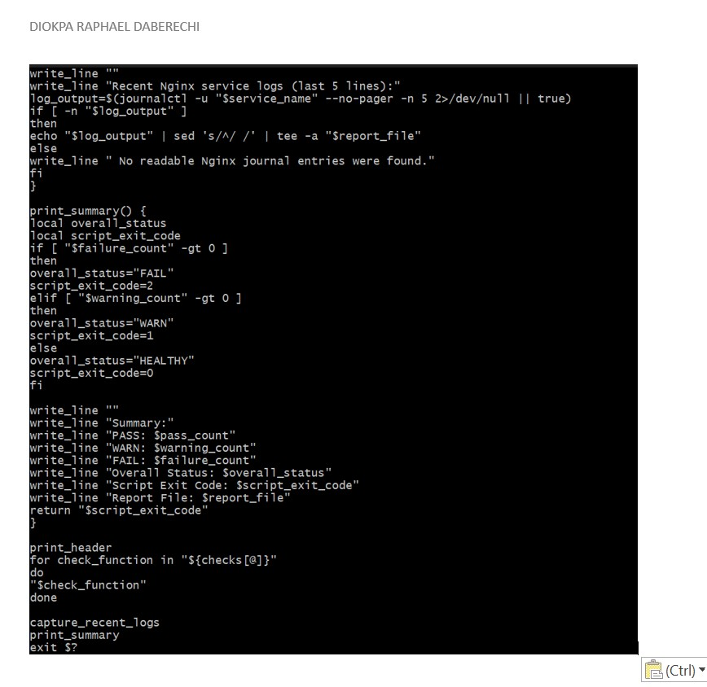

---

#### Screenshot 8 — Output of `bash -n scripts/linux-triage.sh` (no syntax errors) and `ls -l scripts/linux-triage.sh` showing executable permission

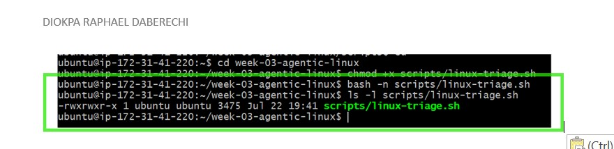

---

### Notes

Answer the following in your own words:

**1. What is stored in the checks array?**

The checks array stores the names of the five functions that check the Nginx service, port 80, HTTP response, disk usage, and available memory.

---

**2. How does the `for` loop use that array?**

The for loop reads each function name from the array and runs the functions one at a time. This allows the script to complete all five health checks in the given order.

---

**3. Why are the health checks separated into functions?**

This is done for documentation purpose, each function handles one specific check. This makes the script easier to read, test, update, and troubleshoot without affecting the other checks.

---

**4. What is the purpose of `$(...)` in this script?**

$(...) runs a command and stores its output. For example, the script uses it to collect the timestamp, hostname, HTTP status code, disk usage, available memory, and recent Nginx logs.

---

**5. Why does the script use different exit codes for HEALTHY, WARN, and FAIL?**

The exit code shows the final condition of the Ubuntu server after completing the five health checks.
The exit codes allow a user or another automation tool to understand the final result without reading the complete report:

0 means all checks passed.
1 means the script found a warning.
2 means at least one check failed.

This helps us quickly understand how serious the issue is after running the triage script. 

---

# Task 5 — Run and Understand the Healthy-State Report

## Goal

Run the Bash script against the healthy server and verify that it creates a report.

### Evidence

#### Screenshot 9 — Output of `./scripts/linux-triage.sh` showing your Full Name and all five check results

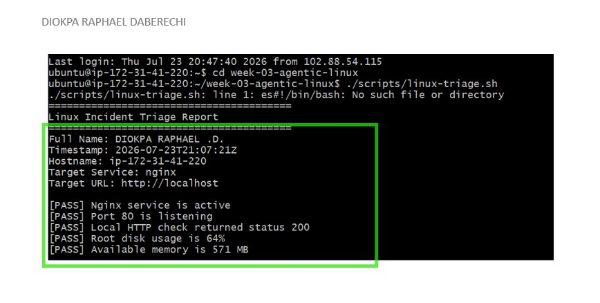

---

#### Screenshot 10 — Output showing the captured exit code and final summary

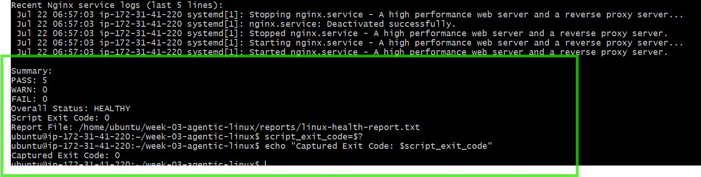

---

### Notes

Answer the following in your own words:

**1. What is the overall status of your healthy baseline?**

The overall status of my baseline is HEALTHY. The report does not contain any failed checks, so I can continue to the incident simulation.

---

**2. Which exact Linux evidence proves the application is serving traffic?**

The report shows:

[PASS] Port 80 is listening
[PASS] Local HTTP check returned status 200

---

**3. Did your script return exit code 0 or 1? Explain why.**

My script returned exit code 0 and this is because, all five health checks passed. Nginx was active, port 80 was listening, the application returned HTTP 200, and the disk and memory values were within the healthy limits.

---

**4. What is the difference between a warning and a failure in this script?**

A warning indicates that the server and application are still functioning, but the script has detected a resource issue that requires attention. This occurs when root disk usage is between 80% and 89%, or when available memory falls below 100 MB.

A failure indicates that a critical health check has failed. This happens when Nginx is not running, port 80 is not listening, the application does not return an HTTP 200 response, or root disk usage reaches 90% or higher.

---

# Task 6 — Create and Run the /linux-triage Skill

## Goal

Turn the Bash script into a reusable, manually invoked Agentic AI workflow.

### Evidence

#### Screenshot 11 — `SKILL.md` showing the frontmatter, allowed tool restrictions, and safety rules

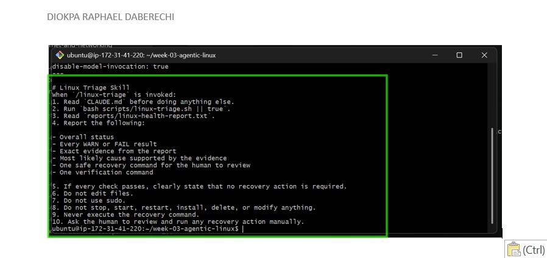

---

#### Screenshot 12 — `/linux-triage` output for the healthy server

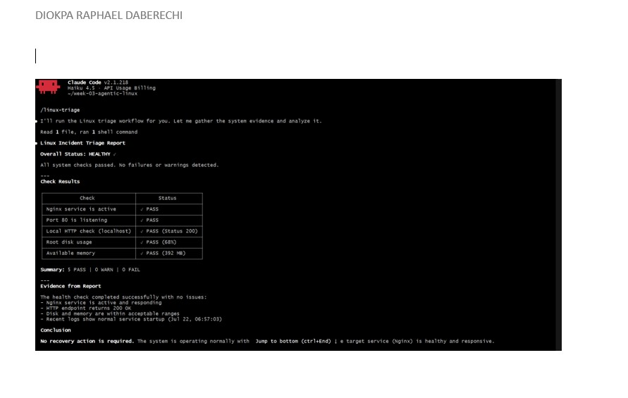

---

### Notes

Answer the following in your own words:

**1. Why does this skill have Bash, Read, and Grep, but not Write?**

The skill requires Bash to execute the Linux triage script, Read to access the generated report, and Grep to search for specific PASS, WARN, or FAIL results. The Write tool is unnecessary because the triage process is designed to inspect and report system status without creating or modifying project files.

---

**2. Why is `disable-model-invocation: true` useful for this skill?**

This setting prevents Claude from automatically selecting and executing the skill. Instead, I must manually invoke /linux-triage, ensuring that the server inspection process remains under my control.

---

**3. What part is performed by Bash, and what part is performed by Claude?**

The Bash script checks Nginx, port 80, the HTTP response, disk usage, available memory, and recent logs. It records the results in linux-health-report.txt.
Claude reads that report, explains the results, identifies warnings or failures, and recommends a safe next step. Claude does not perform the recovery action.

---

**4. Why is this better than asking Claude "Is my server healthy?" without giving it evidence?**

A general question does not provide Claude with enough context about the server's current state. The /linux-triage skill first gathers real-time system data using the Bash script, allowing Claude to base its response on the Nginx status, port availability, HTTP response, disk usage, memory, and logs rather than making assumptions.

---

# Task 7 — Simulate an Nginx Incident and Let the Skill Diagnose It

## Goal

Create a controlled service failure, gather evidence through Bash, and let Claude analyze the evidence without taking recovery action.

### Evidence

#### Screenshot 13 — Output showing Nginx is inactive and the HTTP request fails

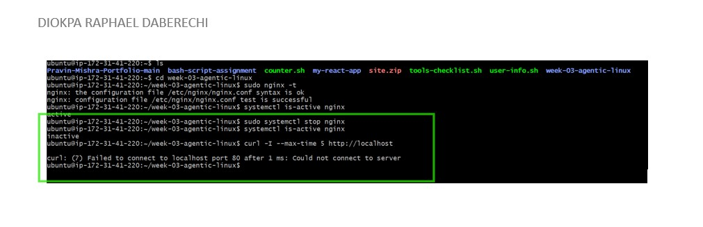

---

#### Screenshot 14 — `/linux-triage` output showing failed evidence, most likely cause, and a suggested recovery command

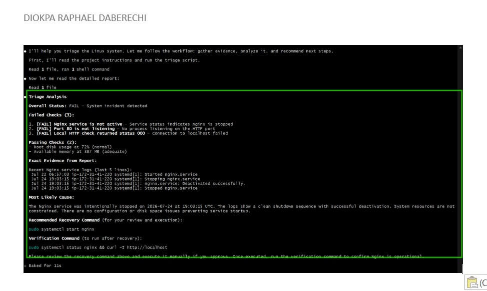

---

#### Screenshot 15 — `incident-failure-report.txt` showing the failed checks and your Full Name

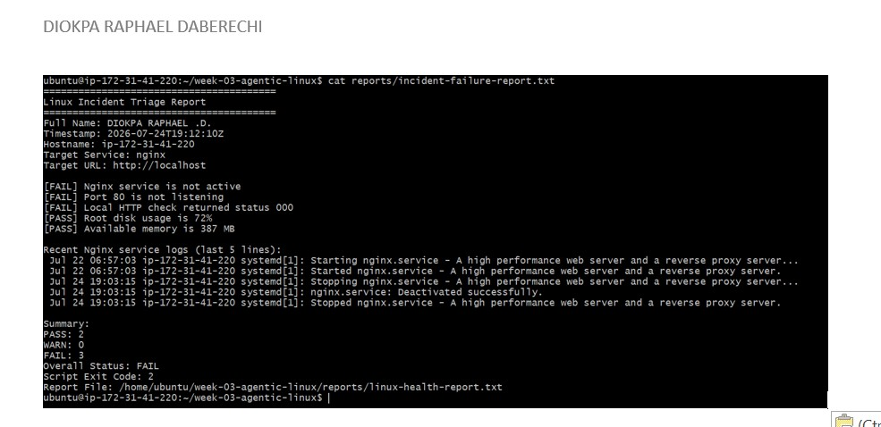

---

### Notes

Answer the following in your own words:

**1. Which three checks failed?**

[FAIL] Nginx service is not active
[FAIL] Port 80 is not listening
[FAIL] Local HTTP check returned status 000

---

**2. What evidence supports the conclusion that Nginx is unavailable?**

The report shows that Nginx is not active, port 80 is not listening, and the local HTTP request returned status 000. Together, these results show that Nginx is unavailable and the application cannot receive HTTP traffic.

---

**3. Did Claude execute the recovery command? Why is that important?**

No Claude did not execute the recovery command, claude only gave suggestion. This is important to prevent an A.I tool from making changes to the Server

---

**4. Which phase of the Agentic Loop is represented by the Bash report?**

The Bash report represents the Gather phase. The script collects current evidence about Nginx, port 80, the HTTP response, disk usage, memory, and recent logs.

---

**5. Which phase is represented by Claude's explanation?**

Claude’s explanation represents the Analyze phase. Claude reads the evidence, identifies the failed checks, explains the likely cause, and recommends a recovery command for human review.

---

# Task 8 — Recover Manually, Verify Again, and Write the Incident Summary

## Goal

Recover the service as the human operator and prove that the system is healthy again.

### Evidence

#### Screenshot 16 — Output showing Nginx is active and `curl -I http://localhost` returns 200 OK

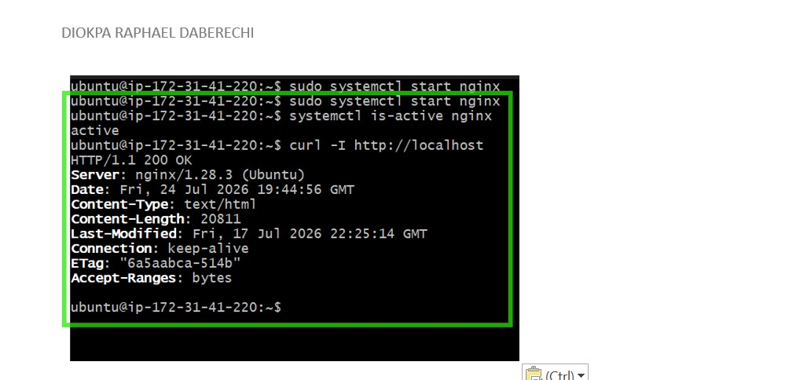
---

#### Screenshot 17 — Second `/linux-triage` output showing successful recovery with no FAIL results

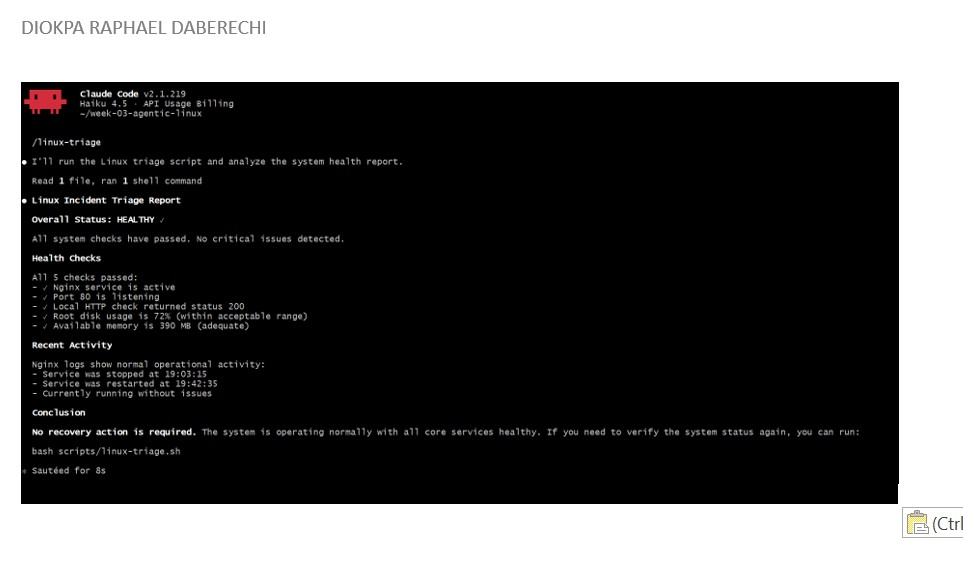

---

#### Screenshot 18 — Output of `ls -lah reports` showing both `incident-failure-report.txt` and `recovery-report.txt`

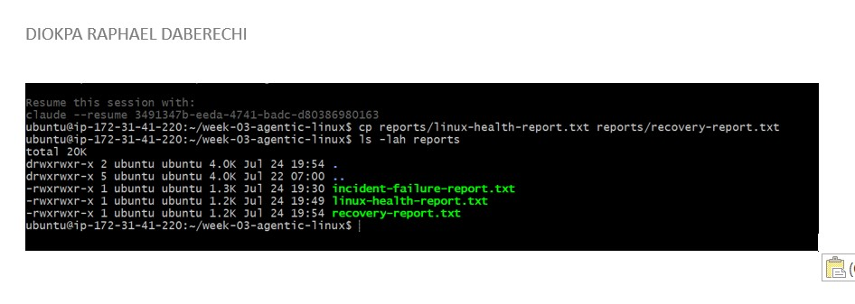

---

#### Screenshot 19 — `incident-summary.md` showing all required sections and your Full Name

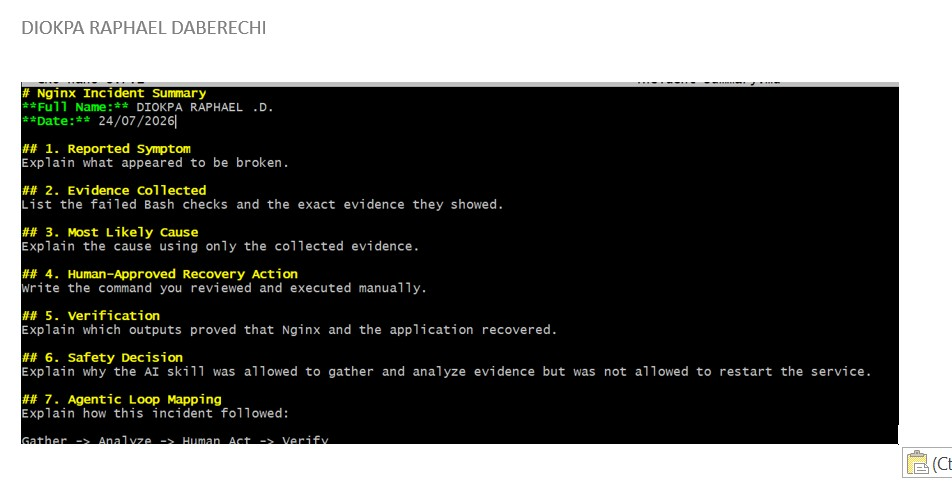

---

### Notes

Answer the following in your own words:

**1. What action did you execute manually?**

After reviewing the evidence and Claude’s recommendation, I manually ran:
sudo systemctl start nginx

This started the Nginx service again.

---

**2. What evidence proves that the service recovered?**

The systemctl is-active nginx command returned active, and the local HTTP request returned HTTP/1.1 200 OK. The second /linux-triage run also showed that the service, port, and HTTP checks passed.

---

**3. Why is the second triage run necessary?**

Starting Nginx does not automatically prove that the complete application is healthy. The second triage run checks the service, port, HTTP response, disk, and memory again to confirm that the server returned to a healthy state.

---

**4. What could go wrong if an AI agent automatically restarted every failed service?**

A failed service may have a configuration problem, resource issue, dependency failure, or another serious cause. Automatically restarting every service could hide the real problem, create a restart loop, or make the incident worse. The evidence should be reviewed before taking action.

---

**5. In one sentence, explain the difference between using AI as a chatbot and using AI in this agentic workflow.**

A chatbot only answers my question, but in this agentic workflow, Claude uses tools to gather and analyze real server evidence while I remain responsible for approving and performing the recovery action.

---

# Incident Summary

Fill in all seven sections below in your own words.

**Full Name:** DIOKPA RAPHAEL .D.

**Date:** 24/07/2026

---

**1. Reported Symptom**

Nginx Service is not active
[FAIL] Port 80 is not listening - No process listening on the HTTP port
[FAIL] Local HTTP check returned status 000 - Connection to localhost failed

---

**2. Evidence Collected**

Recent Nginx service logs (last $ lines):
Jul 22 06:57:03 ip-172-31-41-220 systemd[1]: Started nginx.service
Jul 24 19:03:15 ip-172-31-41-220 systemd[1]: Stopping nginx.service
Jul 24 19:03:15 ip-172-31-41-220 systemd[1]: nginx.service: Deactivated successfully.
Jul 24 19:03:15 ip-172-31-41-220 systemd[1]: Stopped nginx.service

---

**3. Most Likely Cause**

The Nginx service was intentionally stopped on 2026-07-24 at 19:03:15 UTC. The logs show a clean shutdown sequence with successful deactivation. System resources are not constrained. There are no configuration or disk space issues preventing service startup.

---

**4. Human-Approved Recovery Action**

sudo systemctl start nginx

---

**5. Verification**

sudo systemctl status nginx && curl -I http://localhost

nginx.service - A high performance web server and a reverse proxy server
     Loaded: loaded (/usr/lib/systemd/system/nginx.service; enabled; preset: enabled)
     Active: active (running) since Fri 2026-07-24 19:42:35 UTC; 3 days ago
 Invocation: ec3e889902634ea0a367392740359395
       Docs: man:nginx(8)
   Main PID: 18179 (nginx)
      Tasks: 3 (limit: 627)
     Memory: 4.9M (peak: 5.9M)
        CPU: 322ms
     CGroup: /system.slice/nginx.service
             ├─18179 "nginx: master process /usr/sbin/nginx -g daemon on; master_process on;"
             ├─18180 "nginx: worker process"
             └─18181 "nginx: worker process"

---

**6. Safety Decision**

The skill was not allowed to restart the service because restarting Nginx is a write or administrative action that changes the server's state and could impact users or applications.

Restricting this permission ensures that critical operational changes remain under human control, preventing accidental disruptions or unintended consequences. This approach follows the principle of least privilege, where the AI is granted only the permissions necessary to perform diagnostics while leaving corrective actions to an authorized user.

---

**7. Agentic Loop Mapping**

The incident followed the Gather → Analyze → Human Act → Verify workflow as follows:

Gather: The AI skill collected evidence from the server by running the Linux triage script. It gathered information such as the Nginx service status, whether port 80 was listening, the HTTP response, disk usage, available memory, and relevant system logs.

Analyze: After collecting the data, the AI analyzed the results to identify any PASS, WARN, or FAIL conditions. Based on the evidence, it determined the likely cause of the issue and provided a diagnosis without making any changes to the server.

Human Act: The AI presented its findings and recommendations, but the actual corrective action—such as restarting the Nginx service or updating the server configuration—was performed by a human administrator. This ensured that changes to the production environment remained under human control.

Verify: After the corrective action was completed, the Linux triage script was run again to verify that the issue had been resolved. The updated health checks confirmed whether the Nginx service was running correctly, port 80 was listening, the application returned an HTTP 200 response, and the overall server health had returned to a normal state.

---

# LinkedIn Post (Required)

## Evidence

#### LinkedIn Post URL

Paste your LinkedIn post URL here:

https://www.linkedin.com/posts/diokparaphael_dmicohort3-devops-linux-ugcPost-7487628676512206848-ug2Y/?utm_source=share&utm_medium=member_desktop&rcm=ACoAABJFGsoB0Tj582Besj5R2uLnB6itVJv47yU

---

#### Screenshot — Published LinkedIn post

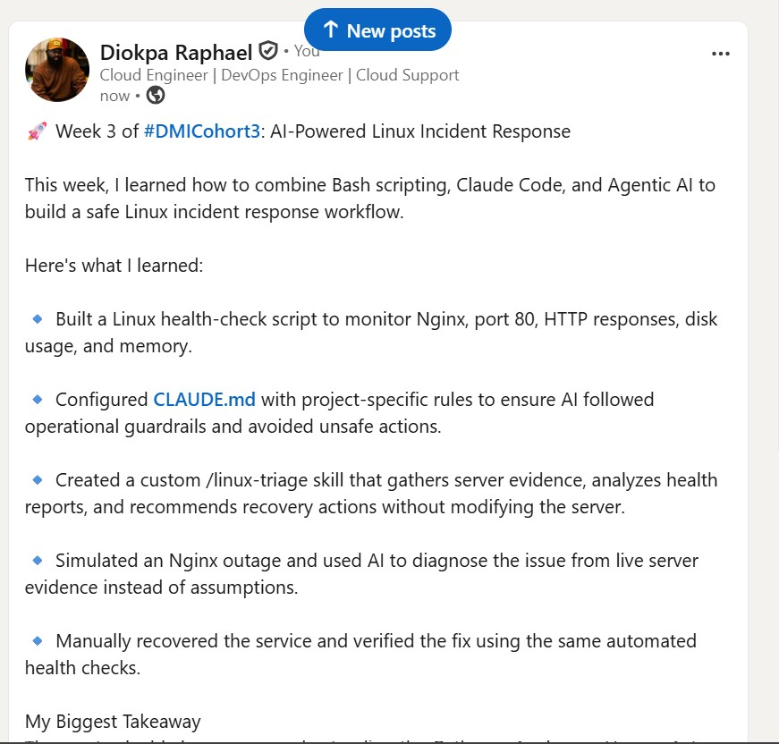

---

# GitHub Repository URL

Paste the URL of your GitHub folder or repository containing the assignment files here:

https://github.com/czarhub/devops-micro-internship-pravinmishra/blob/main/week-03-linux-and-bash-for-devops/assignment-06-ai-assisted-linux-health-check.md

---

# Submission Instructions

- Add all required screenshots in your submission
- Full Name must be visible in required screenshots and the Bash report
- All written answers must be in your own words
- Do not expose sensitive information (keys, passwords, AWS account IDs, tokens)
- GitHub URL must be included in this document

---

# Completion Checklist

- [ ] Task 1: Healthy baseline confirmed, workspace created (Screenshots 1–2, Notes answered)
- [ ] Task 2: CLAUDE.md created with all four sections (Screenshot 3, Notes answered)
- [ ] Task 3: Five-check plan produced by Claude using read-only tools (Screenshot 4, Notes answered)
- [ ] Task 4: `linux-triage.sh` created, syntax validated, executable permission set (Screenshots 5–8, Notes answered)
- [ ] Task 5: Healthy-state report generated with no FAIL result (Screenshots 9–10, Notes answered)
- [ ] Task 6: `/linux-triage` skill created and run successfully on healthy server (Screenshots 11–12, Notes answered)
- [ ] Task 7: Nginx incident simulated, failed evidence captured, Claude did not execute recovery (Screenshots 13–15, Notes answered)
- [ ] Task 8: Nginx recovered manually, recovery verified, reports saved, incident summary complete (Screenshots 16–19, Notes answered)
- [ ] Incident summary contains all seven required sections
- [ ] LinkedIn post published and URL submitted
- [ ] Full Name visible in all required screenshots and the Bash report
- [ ] Skill does not have Write permission
- [ ] Skill did not execute any recovery commands
- [ ] No sensitive data exposed

---

## 📌 About DMI & CloudAdvisory

DevOps Micro Internship (DMI) is a project-based DevOps program run by Pravin Mishra (The CloudAdvisory) focused on real-world execution, systems thinking, and career readiness.

It helps learners build strong DevOps foundations with hands-on experience.

---

## 📌 Resources

- 🌐 DMI Official Website: https://dmi.pravinmishra.com?utm_source=github&utm_medium=readme  
- 🎓 University: https://university.pravinmishra.com?utm_source=github&utm_medium=readme  
- 💬 Discord Community: https://discord.pravinmishra.com?utm_source=github&utm_medium=readme  
- 📝 Blog: https://dmi.pravinmishra.com/blog?utm_source=github&utm_medium=readme  
- ▶️ YouTube Playlist: https://www.youtube.com/playlist?list=PLFeSNDtI4Cho  
- 🔗 Pravin Mishra (LinkedIn): https://www.linkedin.com/in/pravin-mishra-aws-trainer/  
- 🏢 CloudAdvisory (LinkedIn): https://www.linkedin.com/company/thecloudadvisory/

---

*This submission is part of DevOps Micro Internship (DMI) Cohort 3 — Agentic AI Track.*